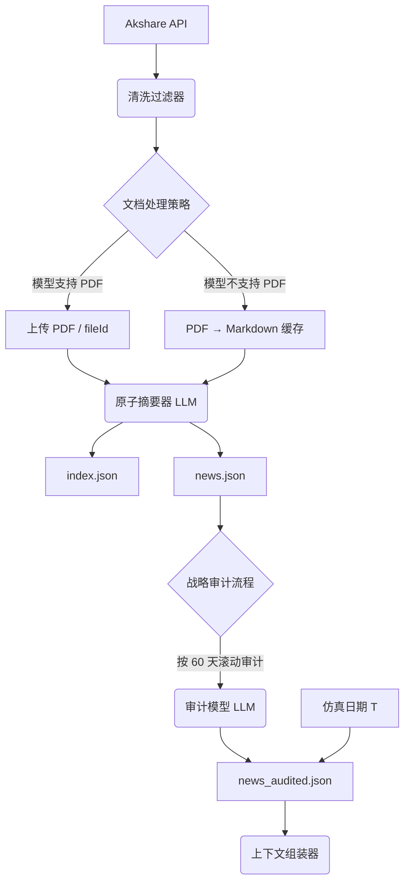

# 上市公司公告新闻系统设计

更新日期：2026-06-12

## 1. 设计目标

以「公司官方公告」作为 AI 交易 Agent 的主要新闻源，提供权威、低噪声、可回测的资讯流。需要解决：

- 长文摘要成本高
- 公告冗余、行政噪声多
- 回测时「未来函数」泄露
- 每只股票的公告 PDF「只下载一次」、按日增量

## 2. 架构



## 3. 目录与缓存

每只股票一个目录：`data/stock_info/<股票名_代码>/`

```text
disclosures/
├── pdfs/            # 原始 PDF（只下载一次）
├── md/              # 可选的 PDF→Markdown 转换缓存
├── index.json       # 公告元数据索引
└── cninfo_list.csv  # 巨潮拉取的公告列表

news/
├── news.json         # 经过原子摘要的公告摘要总表
└── news_audited.json # 经过战略审计的精炼摘要总表（增量追加）
```

缓存策略对接 `shared_data_access/cache_registry.py` 的 `CacheKind.DISCLOSURES`，TTL = 1 天。

## 4. 数据获取与清洗

- 接口：`akshare.stock_zh_a_disclosure_report_cninfo`（A 股）
- 首次入池：默认抓取过去 1 年的公告；后续每日夜间检查增量
- 过滤规则：
  - 排除低价值行政类：股东大会通知、一般法律意见、重复性说明
  - 自动识别财报类公告：年报 / 半年报 / 一季报 / 三季报 / 业绩预告
- 输出：有效公告列表（含 URL、日期、标题）

## 5. 索引与去重（`index.json`）

唯一键：

- 优先：`announcementId`（从 URL 提取）
- 后备：`title + date` 哈希

字段：

- `announcementId` / `orgId` / `stockCode` / `title` / `date` / `url`
- `pdf_path` / `md_path` / `fileId`
- `downloaded` / `summarized` / `audited` / `last_processed_ts`
- `category` / `is_financial_report` / `dedupe_key`
- `audit_model` / `audit_timestamp`

文件命名：`YYYY-MM-DD__<stockCode>__<announcementId>__<slug-title>.pdf`

## 6. 原子化摘要器

处理流程：

1. 检查模型是否在 `SUPPORTED_DIRECT_PDF_MODELS`（`news/disclosures_builder.py:49`）：当前为 `["qwen-doc-turbo", "qwen-long"]`
2. **支持 PDF 直读**：直接上传 PDF（或使用 `fileId`）调用模型生成摘要
3. **不支持 PDF 直读**：
   - 检查 `disclosures/md/` 下是否存在对应 Markdown 缓存
   - 若不存在，调用 PDF→Markdown 工具生成并缓存
   - 更新 `index.json` 的 `md_path` 字段
   - 将 Markdown 文本提交给模型生成摘要

普通公告摘要结构：`date` / `title` / `category` / `summary`（≤100 字） / `impact` / `sentiment` / `influence_window`

财报公告：当前**暂不**做原子摘要，直接跳过；财报深度研究由 `financial-report-summary` skill 单独负责（详见 `docs/fundamental_research/README.md`）。

## 7. 战略审计流程

由 `news/disclosures_builder.py` 的 `audit_news_json` 实现。

触发时机：

- 可独立脚本触发，或在批量更新后自动运行
- 当前 `manage_daily_data` 调用 `disclosures_builder.py --all --audit-model deepseek-v3.2-exp` 默认在 PDF 摘要之后自动跑审计

核心逻辑：

1. 加载 `news/news.json` 全量内容与 `news/news_audited.json`（若存在）
2. 计算两者最新日期：
   - 若 `news.json` 最新日期不大于 `news_audited.json` 最新日期 → 直接退出
   - 否则只选取**新增区间**
3. **分批策略**：若新增区间超过 60 天，按 60 天窗口分批处理；每批完成后立即追加写入 `news_audited.json`，保证断点续审与可靠落盘
4. 模型调用：每批次把 `news_items` 列表作为 JSON 输入，连同 `AUDIT_AND_REFINE_PROMPT` 发给审核模型；解析输出后按 `(title + datetime)` 去重合并
5. 写盘规范：
   - 结果文件：`news_audited.json`
   - 字段：`stock` / `today` / `news_items` / `diagnostics`
   - 写入方式：每批次覆盖写入但保持历史 items 追加扩展，文件始终处于可用状态

## 8. 回测接口

```python
get_news_context(stock_code, simulation_date, lookback_days=60)
```

- 严格防「未来函数」：仅返回 `simulation_date` 之前的数据
- 默认窗口 60 天；自动包含最近季度财报相关公告
- 在组装文本时插入时效标签（如 `今日` / `X 天前`）

## 9. 模型策略

| 角色 | 当前默认 | 备注 |
| --- | --- | --- |
| 原子摘要模型 | `qwen-doc-turbo` | 支持 PDF 直读，速度 / 性价比优先 |
| 审计模型 | `deepseek-v3.2-exp` | 由 `--audit-model` 指定，能力更强，深度分析 |

审计模型由 `.env` 中的 `AUDIT_MODEL_BASE_URL` / `AUDIT_MODEL_API_KEY` 提供凭证。

## 10. 并发与性能

- `--all` 批量处理模式使用 `concurrent.futures.ThreadPoolExecutor`
- 原子摘要 (`update_disclosures_for_stock`) 与战略审计 (`audit_news_json`) 都按「每只股票一个线程」并发处理
- 由 `manage_daily_data --max-workers N` 控制并发度

## 11. 与上层链路的关系

| 阶段 | 谁调用 | 备注 |
| --- | --- | --- |
| 每日刷新 | `selection_system build-announcements`（增量） | `refresh_all_for_date.py --include-selection-universe` 路径 |
| 每日刷新 | `news/disclosures_builder.py --all`（增量 + audit） | `manage_daily_data` 默认路径，由 `manage_daily_data --skip-disclosures` 可跳过 |
| 选股输入 | `04_recent_company_announcements.json` | 从各股 `news/news.json` 聚合最近 3 天公告 `summary`，仅保留选股阶段需要的轻量摘要字段 |
| 三账本研究 | `04_stock_research/*_research.md` | `services/pipeline/steps/build_stock_research.py` 把公告摘要写入逐股研究包 |

详见：

- `services/selection_system/announcement_summary.py`
- `services/pipeline/steps/build_stock_research.py`
- `.codex/skills/financial-report-summary/SKILL.md`
