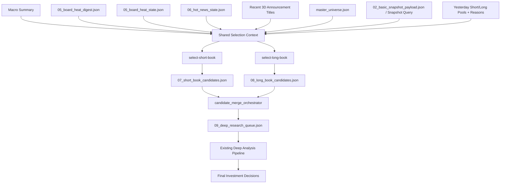

# AI选股系统一期落地设计

更新日期：2026-04-04

## 0. 当前结论

这份一期设计以当前仓库已经形成的输入层为准，不再沿用早期 `hot_news_state + board_heat_state + 单一 selection_skill` 的旧口径。

当前一期的正确主轴是：

1. 先稳定生成共享研究输入层。
2. 再让两个不同 mandate 的子 agent 做两套初筛：
   - 短期持股池：目标持有 `1-2` 个月
   - 长期持股池：目标持有 `3-12` 个月
3. 再把入选股票送入现有成熟的深度分析流程。
4. 最终由主 agent 汇总两类机会、处理重叠与冲突，并准备后续交易输入。

一句话：

一期不是直接让一个 agent 在超长上下文里“拍脑袋选股”，而是让它在“宏观时效性 + 板块时效性 + 主题时效性 + 个股时效性”共同约束下，生成两种不同持股风格的候选池，再复用成熟的深度分析链路。

## 1. 背景与目标

当前仓库里已经逐步形成了比旧方案更成熟的输入层：

1. 宏观总结：回答当前世界和大类资产背景。
2. 渐进式热点主题总结：回答当前市场在交易哪些叙事，以及这些叙事是强化、延续还是退潮。
3. 板块热点层：回答市场是否真的在交易这些叙事。
4. 股票 snapshot：回答具体股票的估值、质量、增长、波动、流动性等事实。
5. 昨日股池和持有理由：回答系统连续性，不让今天完全失忆。

因此，一期目标不应再定义为“做一个新的单体选股 skill”，而应定义为：

1. 用共享输入层建立今天的市场事实底座。
2. 基于同一事实底座，分别生成短期与长期两套候选股池。
3. 把候选股池与现有深度分析流程衔接起来。
4. 逐步沉淀为后续真实交易和更复杂组合管理的上游输入。

## 2. 设计原则

### 2.1 共享事实，不共享裁决标准

短期持股和长期持股看到的是同一个世界，但它们做决策的标准不同。

- 短期池更关心：主题是否强化、板块是否确认、催化是否仍在、量价是否支持、是否有近端事件驱动。
- 长期池更关心：公司质量、长期景气、盈利与估值、财报可靠度、是否适合跨季度持有。

### 2.2 先广筛，再深研

`snapshot` 适合做初筛，不适合整份塞进 prompt。

因此应采用：

1. 先用宏观、主题、板块、公告建立“今日机会地图”。
2. 再按不同 mandate 对 `snapshot` 做字段检索与排序。
3. 先得到候选池。
4. 最后只对候选股票执行完整深度分析。

### 2.3 时效性新闻必须分层

这一层不能再只靠“今日新闻摘要”。

建议明确分成：

1. 宏观时效性新闻：进入宏观总结。
2. 市场时效性新闻：进入板块热度与渐进式主题总结。
3. 微观个股时效性新闻：进入最近 `3` 天公告标题与个股研究包。

### 2.4 复用成熟深度分析链路

当前仓库最成熟的逐股深度分析链路已经在 [`auto-trading-daily-pipeline`](../../.codex/skills/auto-trading-daily-pipeline/SKILL.md) 中。

一期不应推倒重来，而应把它定位为：

- 上游：双 mandate 的候选池生成器
- 下游：已有成熟的逐股深度分析器

## 3. 一期总体架构

一期建议采用“共享上下文层 + 双选股头 + 深度分析队列 + 主 agent 汇总”的结构。



## 4. 共享研究输入层

### 4.1 目标

共享输入层的职责不是直接选股，而是先回答：

1. 今天市场的大环境是什么。
2. 今天重点交易哪些叙事。
3. 这些叙事是否获得板块资金确认。
4. 哪些公司今天或最近几天有微观层面的重要事件。
5. 在股票宇宙里，有哪些股票同时满足主题、板块与个股事实的交集。

### 4.2 建议输入构成

建议一期统一采用以下输入层。

#### 1. 宏观总结

建议输入：

- 最近一天宏观总结文件

职责：

1. 定义当前 macro regime。
2. 给选股 agent 提供风险偏好、利率、通胀、地缘、美元、大宗品等顶层背景。
3. 作为短期池和长期池共同的上层约束。

#### 2. 渐进式主题总结

建议输入：

- `data/selection_runs/YYYY-MM-DD/06_hot_news_state.json`

职责：

1. 维护主题级研究记忆。
2. 说明哪些主题正在强化、哪些退潮、哪些被证伪。
3. 提供 `linked_boards`、主题驱动路径、风险点和后续观察点。

这一层不是“今天新闻摘要”，而是“可交易叙事的演化记忆”。

#### 3. 板块热点层

建议输入：

1. `data/selection_runs/YYYY-MM-DD/05_board_heat_digest.json`
2. `data/selection_runs/YYYY-MM-DD/05_board_heat_state.json`
3. 按需调用板块查询脚本

职责：

1. `05_board_heat_digest.json`
   - 提供全局板块热点导航
   - 告诉 agent 今天哪些板块最热、哪些板块近 `5/20` 日最强
2. `05_board_heat_state.json`
   - 提供今天热点板块的研究结论
   - 解释板块为什么强、内部是集中还是扩散
3. 查询脚本
   - 在主题关联板块不在 `05_board_heat_state.json` 时，按需补查具体板块详情

#### 4. 微观个股时效性输入

建议新增：

- 最近 `3` 天全股票宇宙内公司的公告标题摘要

职责：

1. 让 agent 在初筛前先形成“今天微观层面发生了什么”的印象。
2. 及时发现：
   - 业绩预告
   - 减持 / 回购
   - 监管函 / 诉讼
   - 订单 / 中标
   - 产品获批 / 并购 / 资产重组
3. 为短期池提供事件催化视角。
4. 为长期池提供财报暴雷和治理风险视角。

这一层以“标题摘要”为主，不在初筛阶段直接展开全文。

#### 5. 股票宇宙

建议输入：

- `data/universe/master_universe.json`

职责：

1. 定义当前允许优先研究的股票范围。
2. 让主题总结中的 `linked_symbols_in_universe` 有明确映射依据。
3. 控制一期上下文规模。

当前宇宙不是封闭集合，但一期默认以它作为初筛主范围。

#### 6. 股票 snapshot

建议输入：

- `02_basic_snapshot_payload.json`

职责：

1. 提供估值、增长、质量、波动、流动性、走势等事实层。
2. 作为短期池和长期池的重要筛选底稿。
3. 不直接整份塞给模型，而是通过字段说明和查询/排序接口按需使用。

#### 7. 连续性输入

建议输入：

1. 昨天的短期候选池与入选原因
2. 昨天的长期候选池与入选原因
3. 昨天深度分析后保留的重点跟踪点

职责：

1. 防止今天完全失忆。
2. 帮助区分“继续持有逻辑”与“新开仓逻辑”。
3. 让长期池具备真正的跨日延续性。

## 5. Snapshot 使用方式

### 5.1 为什么不能全量塞给 AI

如果 `02_basic_snapshot_payload.json` 覆盖 `100` 只股票，每只 `30+` 个字段，完整上下文会非常大，且大部分字段在当前问题下无用。

因此一期不建议：

1. 让模型直接完整阅读全量 snapshot。
2. 把 snapshot 当成一个超长静态 prompt。

### 5.2 推荐方案

建议把 snapshot 使用方式定义为“字段说明 + 排序接口 + 单股查询接口”。

即：

1. 给 agent 一份 snapshot 字段说明。
2. 给 agent 一份轻量排序能力。
3. 当 agent 关心某些股票时，再读取对应股票的详细 snapshot。

### 5.3 短期池更关心的字段

短期池建议优先关注：

1. `daily_change_pct`
2. `return_3m`
3. `sharpe_3m`
4. `volatility_3m`
5. `max_drawdown_3m`
6. `turnover_rate`
7. `avg_turnover_30d`
8. `liquidity_score`

这些字段更适合回答：

1. 股票最近是否在走强。
2. 当前强势是稳步强化还是高波动冲高。
3. 是否具备足够的成交与流动性支撑。

### 5.4 长期池更关心的字段

长期池建议优先关注：

1. `roe`
2. `revenue_growth_yoy`
3. `net_income_growth_yoy`
4. `gross_margin`
5. `net_profit_margin`
6. `pe_ttm`
7. `pb`
8. `ps`
9. `pe_2y_percentile`
10. `return_1y`
11. `max_drawdown_1y`

这些字段更适合回答：

1. 公司质量是否足够高。
2. 增长是否仍在。
3. 当前估值是否仍有中期空间。
4. 是否适合拿过一个完整财报周期。

## 6. 双选股头设计

### 6.1 `select-short-book`

#### 定位

短期持股池，目标持有 `1-2` 个月。

#### 主要关注点

1. 主题是否正在强化。
2. 板块是否获得市场确认。
3. 公告或新闻催化是否仍有近端交易价值。
4. 个股是否具备足够流动性和短中期强度。
5. 当前是否仍处于可参与而不是明显退潮的阶段。

#### 典型风格

1. 更重视主题与板块交集。
2. 更接受中高波动，但必须有明确催化和退出逻辑。
3. 对财报窗口和突发利空更敏感。

#### 建议输出

建议输出 `10` 只左右候选股，且每只至少包含：

1. `symbol`
2. `stock_name`
3. `selected_reason`
4. `theme_alignment`
5. `board_confirmation`
6. `announcement_signal`
7. `snapshot_highlights`
8. `holding_horizon`
9. `why_short_book`
10. `main_risks`
11. `priority_rank`

### 6.2 `select-long-book`

#### 定位

长期持股池，目标持有 `3-12` 个月。

#### 主要关注点

1. 行业长期逻辑是否仍在。
2. 公司质量和盈利能力是否足够好。
3. 当前估值是否仍有中期赔率。
4. 财报窗口是否存在暴雷风险。
5. 昨日长期池中的 thesis 是否被强化、延续或削弱。

#### 典型风格

1. 更重视公司质量和跨季度逻辑。
2. 不要求短期最热，但要求长期理由更稳。
3. 默认低换手，不因短期波动频繁切换。

#### 建议输出

建议输出 `10` 只左右候选股，且每只至少包含：

1. `symbol`
2. `stock_name`
3. `selected_reason`
4. `long_term_thesis`
5. `valuation_view`
6. `quality_view`
7. `earnings_reliability_view`
8. `announcement_risk_check`
9. `holding_horizon`
10. `why_long_book`
11. `main_risks`
12. `priority_rank`

## 7. 候选池合并层

### 7.1 为什么需要合并层

双选股头共享事实，但可能会出现：

1. 同一只股票同时入选短期池和长期池。
2. 某只股票短期上适合，但长期逻辑不足。
3. 某只股票长期很强，但短期财报或公告风险很大。

因此一期需要一个轻量 `candidate_merge_orchestrator`。

### 7.2 主要职责

1. 去重。
2. 处理短期池和长期池的重叠股票。
3. 形成最终的深度分析队列。
4. 标记每只股票进入深度分析时的 mandate：
   - `short_only`
   - `long_only`
   - `both`

### 7.3 输出建议

建议输出：

- `09_deep_research_queue.json`

内容至少包括：

1. 股票代码与名称
2. 来源池
3. 优先级
4. 进入深研的核心理由
5. 本轮深研要重点验证的问题

## 8. 与现有深度分析流程的衔接

### 8.1 当前结论

现有 [`auto-trading-daily-pipeline`](../../.codex/skills/auto-trading-daily-pipeline/SKILL.md) 已经具备成熟的逐股深度分析能力。

因此，一期最合理的做法不是重写一套新的逐股深研系统，而是：

1. 上游新增候选池生成与分 mandate 初筛。
2. 下游继续复用现有成熟深度分析流程。

### 8.2 推荐衔接方式

一期建议分两段。

#### 阶段 A：候选池生成

由短期池和长期池各自先产出 `10` 只候选。

#### 阶段 B：深度分析

再从候选池中选择优先级更高的股票进入现有深度分析流程。

默认建议：

1. 每个池先取 `Top 3-5` 做完整深研。
2. 若用户确认，再把剩余候选继续展开。

原因是：

1. `10 + 10` 的初筛适合广覆盖。
2. `10 + 10` 全部跑完整深研，成本过高。
3. 真正需要深研的通常只是最有把握的少数。

### 8.3 两套 prompt_flow

后续建议保留统一的深度分析框架，但拆成两个 mandate 变体：

1. `skill_flow_short_book.json`
2. `skill_flow_long_book.json`

两者共享：

1. 基础结构化分析框架
2. 庭审逻辑
3. 事实/推断分离规则
4. 风险控制底线

两者主要区别在：

1. 角色定位
2. 估值门槛
3. 对催化和量价的重视程度
4. 对财报窗口和短期风险的敏感度

## 9. 建议产物结构

### 9.1 每日运行目录

建议一期逐步收敛到以下产物口径：

```text
data/selection_runs/YYYY-MM-DD/
  03_news_prompt_input.json
  04_recent_company_announcements.json
  05_board_heat_digest.json
  05_board_heat_state.json
  06_hot_news_state.json
  07_shared_selection_context.md
  08_short_book_candidates.json
  09_long_book_candidates.json
  10_candidate_merge.json
  11_deep_research_queue.json
  run_manifest.json
```

说明：

1. `04_recent_company_announcements.json`
   - 最近 `3` 天公告标题摘要
2. `07_shared_selection_context.md`
   - 给双选股头看的统一上下文摘要
3. `08_short_book_candidates.json`
   - 短期候选池
4. `09_long_book_candidates.json`
   - 长期候选池
5. `10_candidate_merge.json`
   - 去重与 mandate 合并结果
6. `11_deep_research_queue.json`
   - 进入现有深度分析流水线的队列

### 9.2 长期状态目录

建议继续保留：

```text
data/
  universe/
    master_universe.json
  selection_runs/
    YYYY-MM-DD/
  skill_runs/
    YYYY-MM-DD/
  global_cache/
    board_metrics_ths/
      daily_snapshots/YYYY-MM-DD.json
      market_snapshots/YYYY-MM-DD.json
```

说明：

1. `selection_runs` 负责市场级和候选池级输入。
2. `skill_runs` 负责逐股深度分析与后续交易决策。
3. 二者不是重复系统，而是上下游关系。

## 10. 一期主流程

建议把一期主流程定义为：

```text
Step 1. 生成共享输入层
    -> 宏观总结
    -> 03_news_prompt_input.json
    -> 05_board_heat_digest.json
    -> 05_board_heat_state.json
    -> 06_hot_news_state.json
    -> 最近 3 天公告标题摘要
    -> master_universe.json

Step 2. 构建 shared_selection_context
    -> 汇总宏观、板块、主题、公告、昨日股池、snapshot 使用说明

Step 3. 运行 select-short-book
    -> 产出 10 只短期候选股

Step 4. 运行 select-long-book
    -> 产出 10 只长期候选股

Step 5. 运行 candidate_merge_orchestrator
    -> 去重
    -> 形成深度分析队列

Step 6. 对高优先级股票运行现有深度分析流程
    -> 复用 auto-trading-daily-pipeline

Step 7. 汇总最终投资建议
    -> 统一短期和长期两套视角
```

## 11. 一期实施顺序

### 阶段 A：共享输入层固化

1. 固化宏观总结输入口径。
2. 固化 `06_hot_news_state.json`。
3. 固化 `05_board_heat_digest.json` 与 `05_board_heat_state.json`。
4. 增加最近 `3` 天公告标题摘要文件。

### 阶段 B：snapshot 查询层

1. 先定义 snapshot 字段说明。
2. 增加按字段排序与筛选能力。
3. 增加单股 snapshot 查询能力。

### 阶段 C：双选股头

1. 实现 `select-short-book`。
2. 实现 `select-long-book`。
3. 明确两套 mandate 的输出契约。

### 阶段 D：候选池合并层

1. 实现去重与 mandate 标记。
2. 形成深度分析队列。

### 阶段 E：接入现有深度分析链路

1. 把候选队列送入现有成熟逐股深度分析流程。
2. 优先验证 `Top 3-5` 股票的闭环。

## 12. 一期验收标准

完成一期后，至少应满足：

1. 能稳定生成共享输入层。
2. 能基于同一输入层分别输出短期候选池和长期候选池。
3. 能把最近 `3` 天公告标题纳入初筛，而不是只看主题和板块。
4. 能让两个选股头对 snapshot 做按需检索，而不是整份硬塞上下文。
5. 能把候选池无缝送入现有深度分析流程。
6. 能清楚区分“短期看机会”和“长期可持有”的理由。
7. 不污染现有成熟的 `skill_runs` 深度分析链路。

## 13. 当前开放问题

当前仍待明确的问题主要有：

1. 最近 `3` 天公告标题摘要的最佳文件格式是什么。
2. snapshot 查询层是优先做脚本接口，还是先做更轻的静态排序文件。
3. 短期池和长期池是否都固定输出 `10` 只，还是允许动态数量。
4. 同一只股票同时进入两池时，最终深研是合并一次做，还是按双 mandate 分开写。
5. 深度分析阶段是默认每池 `Top 3-5`，还是允许用户决定扩大范围。
6. `skill_flow_short_book.json` 与 `skill_flow_long_book.json` 应该共用多少结构。

## 14. 结论

当前一期设计的核心已经不再是旧文档中的：

1. `hot_book_state`
2. `core_book_state`
3. `portfolio_orchestrator`

而是新的主轴：

1. 共享研究输入层
2. 双 mandate 的候选池初筛
3. 候选池合并与深研队列
4. 复用现有成熟逐股深度分析链路

因此，一期最重要的不是再造一个全新的万能 agent，而是把以下四件事真正跑顺：

1. 宏观、板块、主题、公告、snapshot 这五层输入协同起来。
2. 在同一事实底座上稳定地产出短期池与长期池。
3. 让 snapshot 通过查询而不是整份塞上下文的方式服务初筛。
4. 让现有成熟深度分析流程成为候选池的下游深研引擎。

只要这四层闭环跑顺，一期就已经具备了向更完整 AI 选股系统和真实交易系统演进的基础。
