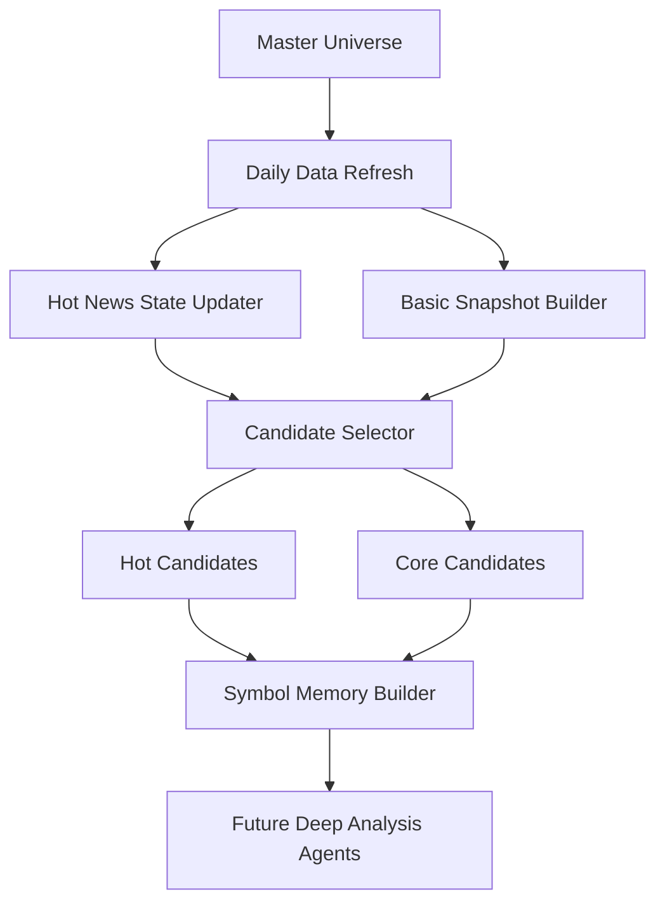

# AI选股系统一期落地设计

更新日期：2026-03-16

## 0. 当前实施状态

### 0.1 已完成

1. `master_universe` 基础设施已落地。
2. 已新增选股系统初始化脚本：
   - `scripts/manage_selection_system.py`
3. 已建立基础目录骨架：
   - `data/universe/`
   - `data/market_state/`
   - `data/symbol_memory/`
   - `data/selection_runs/`
4. `master_universe` 已由人工扩充到 `110` 只股票，当前可作为一期样例池继续开发。
5. 当前基线已提交本地 git：
   - commit: `af38215`
6. 已落地第一版可运行日跑链路：
   - `raw_news_item`
   - `news_item`
   - `simplified_snapshot`
   - `theme_state`
   - `symbol_hot_state`
   - `candidate_selector`
   - `symbol_memory`
7. 已支持第一版日跑模式：
   - 默认启用高质量 AkShare 快讯源
   - `--cache-only`
   - `--no-live-feeds`
8. 已验证 AkShare 实时快讯可正常访问。

### 0.2 正在实施中的一期方案

本轮开始，文档从“纯讨论稿”切换为“实施设计稿”。后续代码以这套方案为主推进。

当前选择的第一版落地方案：

1. 不直接做重型 LLM 驱动的全自动深研链。
2. 先做一条“规则可跑通、产物可检查、后续可插入强模型”的轻量流水线。
3. `hot_news_state` 第一版采用：
   - `raw_news_item`
   - `news_item`
   - `theme_state`
   - `symbol_hot_state`
4. 第一版输入优先级已经修正为：
   - 高质量 AkShare 市场快讯源为主输入
   - 公告/新闻审计产物为个股催化辅助输入
   - `basic_info_cache`
   - `trade_summary`
5. 第一版候选筛选采用“规则打分 + 可解释 reasons”，不给系统一上来塞黑盒决策器。

### 0.3 当前实施顺序

1. 完善 `master_universe`
   - 已完成基础文件与校验
2. 落地 `selection_runs/{date}` 运行目录和每日产物
3. 落地 `raw_news_item` 采集与标准化
4. 落地 `news_item` 高保真结构化提取
5. 落地 `theme_state` / `symbol_hot_state` 聚合
6. 落地 `candidate_selector`
7. 落地 `symbol_memory`
8. 补强文档、日志、验证样例
9. 后续再引入强模型增量融合和更好的主题归并

### 0.4 当前代码落地结果

当前已实现的主命令：

```bash
python scripts/manage_selection_system.py --base-dir data init
python scripts/manage_selection_system.py --base-dir data validate-universe
python scripts/manage_selection_system.py --base-dir data show-universe --limit 10
python scripts/manage_selection_system.py --base-dir data run-daily --date YYYY-MM-DD --cache-only
python scripts/manage_selection_system.py --base-dir data run-daily --date YYYY-MM-DD --cache-only --no-live-feeds
```

当前 `run-daily` 产物：

```text
data/selection_runs/YYYY-MM-DD/
  01_raw_news_items.json
  02_news_items.json
  03_simplified_snapshot.json
  04_theme_state.json
  05_symbol_hot_state.json
  06_hot_candidates.json
  07_core_candidates.json
  08_symbol_memory.json
  run_manifest.json
```

同时会回写长期状态：

```text
data/market_state/raw_news/YYYY-MM-DD.json
data/market_state/raw_news/raw_news_manifest.json
data/market_state/theme_state.json
data/market_state/symbol_hot_state.json
data/market_state/runtime_hot_pool.json
data/market_state/runtime_core_pool.json
data/market_state/runtime_holdings_guardrail.json
data/symbol_memory/index.json
data/symbol_memory/{symbol}.json
```

### 0.5 最新验证记录

已完成的验证：

1. `master_universe` 校验通过，当前股票数 `110`。
2. `cache-only` 模式下，`2026-03-15` 选股链路已完整跑通。
3. 默认启用 AkShare 高质量快讯源的模式下，`2026-03-16` 选股链路已完整跑通。
4. 最新一次默认新闻主链运行中：
   - `raw_news_items`: `167`
   - `themes`: `14+`
   - `symbol_hot_state`: `110`
   - `hot_candidates`: `12`
   - `core_candidates`: `12`
   - `symbol_memory`: `14`

### 0.6 当前已知限制

1. `basic_info_cache` 覆盖率仍不足，当前 `cache-only` 只能命中一部分股票；未命中的股票仍可进入热点链，但基本面打分会偏弱。
2. 当前宏观输入仍来自本地 `data/macro_economy/`，如果该目录没有新文件，命中的可能是旧宏观总结。
3. `theme_state` 第一版仍是规则聚合，尚未引入你设想中的“强模型渐进式融合 skill”。
4. `board_state` 仍未落地，一期继续维持 `theme_state -> symbol_hot_state` 两层。
5. `core_candidates` 当前仍是规则打分，不代表最终投资决策，只是为后续深挖缩小范围。
6. 搜索 API 补充层尚未接入，当前仍主要依赖 AkShare 高质量快讯源和短窗口公告辅助。

## 1. 背景与目标

当前主系统以固定股票池、单套 prompt flow、单日 `skill_runs` 输入为核心，适合对少量股票做较重的深度研究，但不适合以下新场景：

1. 在 300-400 只备选股中动态筛选机会。
2. 同时维护“热点快进快出”和“长期基本面配置”两类策略。
3. 每日低成本更新市场热点状态，而不是每天重算全量长上下文。
4. 为单只股票维护可复用的历史分析记忆，而不是将所有历史堆入 `03_agent_input.md`。

一期目标不是直接上线实盘，也不是一次性完成全自动深度研究系统，而是先搭建一条可持续扩展的“候选筛选与记忆基座”。

一期只落地四个模块：

1. `master_universe`：主股票宇宙。
2. `hot_news_state`：渐进式热点状态库。
3. `candidate_selector`：候选股筛选器。
4. `symbol_memory`：个股轻量记忆包。

## 2. 一期边界

### 2.1 一期必须完成

1. 能维护一份 300-400 只股票的主股票宇宙。
2. 能每日收盘后更新市场、行业、个股相关新闻与公告的结构化状态。
3. 能从主股票宇宙中筛出两类候选：
   - 热点候选 `hot_candidates_topN`
   - 长线候选 `core_candidates_topN`
4. 能为候选股票生成轻量记忆包，供后续 agent 深挖。
5. 新链路与现有 `skill-only` 主链路并存，不破坏当前 `manage_daily_data -> run_daily_pipeline -> run_post_trade`。

### 2.2 一期明确不做

1. 不接入真实券商交易接口。
2. 不做分钟级或 tick 级实时交易执行。
3. 不直接替换现有 `configs/prompt_flow/skill_flow.json` 主链路。
4. 不上来就做 20 个并发子 agent 的全自动调度器。
5. 不把 BettaFish 整套流程直接搬入主仓库。

## 3. 总体架构

一期建议采用“共享数据底座 + 双策略候选头 + 个股记忆包”的轻量架构。



核心原则：

1. 共享上游数据，不共享超长 prompt。
2. 先结构化筛选，再对少量候选做深挖。
3. 历史记忆按股票拆分，不走全局拼接。
4. 热点策略和长线策略共享输入层，只在候选规则和决策逻辑处分叉。

## 4. 模块设计

## 4.1 `master_universe`

### 4.1.1 职责

维护整个系统关注的股票宇宙，作为所有筛选与分析的上游输入。

它不是“今日交易股池”，而是“长期观察范围”。

### 4.1.2 设计要求

1. 规模目标：`300-400` 只 A 股。
2. 包含：
   - 行业龙头
   - 细分赛道前 1-2 名
   - 关键 ETF 或对冲标的
   - 少量观察型新方向标的
3. 静态底表尽量保持精简，动态标签与运行状态不放在这一层维护。

### 4.1.3 推荐存储位置

新增目录：

- `data/universe/master_universe.json`

不建议直接把这一层继续塞进 [configs/stock_pool.py](/home/zhangbeiqing/programer/AI-Value-Investing-Agent/configs/stock_pool.py)，因为当前主链路很多模块默认把 `TRACKED_A_STOCKS` 视作“今日主分析池”，直接扩成 300-400 只会显著放大现有开销。

### 4.1.4 数据结构建议

一期建议把 `master_universe` 设计成“极简静态底表”，只存低频变化、适合人工维护的基础字段。

每只股票默认只包含：

```json
{
  "symbol": "600036.SH",
  "name": "招商银行",
  "sector": "银行",
  "industry": "股份制银行"
}
```

字段说明：

1. `symbol`
   唯一标识，必须人工确认准确。
2. `name`
   股票简称，便于人工核对。
3. `sector`
   一级行业或大类板块。
4. `industry`
   更细一级的行业归属。

### 4.1.5 字段维护原则

`master_universe` 不应承担运行时状态和主观分析职责。

因此以下字段一期不放入 `master_universe`：

1. `strategy_tags`
2. `theme_tags`
3. `priority`
4. `is_active`
5. `note`
6. 各类热点分数、候选标记、持仓状态

这些字段应分别进入：

1. 运行时产物：
   - `runtime_hot_pool`
   - `runtime_core_pool`
   - 候选打分结果
2. 个股记忆层：
   - `symbol_memory`
   - `thesis_state`
   - `decision_history`

### 4.1.6 录入方式建议

`symbol` 和 `name` 通常由你自己确定。

`sector` 和 `industry` 不要求你手工逐个填写。更合适的方式是：

1. 先由一个单独的 AI/脚本根据股票代码自动补全 `sector` 和 `industry`
2. 再由你做一次人工抽查和修正

也就是说，`master_universe` 的推荐维护流程是：

```text
你先给出 symbol/name
    -> 辅助 AI 自动补全 sector/industry
    -> 你人工检查
    -> 固化为 master_universe
```

这样可以减少 300-400 只股票的手工录入负担，同时保留最终配置的人工可控性。

### 4.1.7 衍生池

一期不直接改主股票池，而是在运行期生成：

1. `runtime_hot_pool.json`
2. `runtime_core_pool.json`
3. `runtime_holdings_guardrail.json`

其中：

- `runtime_hot_pool`：热点候选池，日更。
- `runtime_core_pool`：长线候选池，周更为主，重大事件触发增量更新。
- `runtime_holdings_guardrail`：确保当前持仓股票强制保留在候选分析范围内。

## 4.2 `hot_news_state`

### 4.2.1 职责

把每日新增的宏观、行业、个股、公告、资金面信息，维护成一个“渐进式热点状态库”。

这层不是简单做“每日新闻摘要”，而是要维护一套可增量更新、可追踪强化或衰减的主题状态与个股映射状态。

### 4.2.2 为什么不能继续只用 `03_agent_input.md`

如果把近 2 个月热点新闻都塞进 `03_agent_input.md`：

1. 上下文会快速膨胀。
2. 每天都要让模型重复阅读大量旧内容。
3. 无法对单个主题做衰减、去重、归并。
4. 无法支持热点策略的快速增量更新。

### 4.2.3 输入源建议

一期建议把输入源分成三层：

1. 稳定 feed：
   - 东方财富财经早餐
   - 东方财富全球快讯
   - 同花顺全球财经直播
   - 财联社电报
   - 个股新闻 feed
   - 巨潮/交易所公告
   - 现有公告链路
2. 定向检索：
   - Tavily / Anspire
3. 高成本深度研究：
   - U 深搜
   - U 深研
3. 未来扩展：
   - 行业研报摘要
   - 龙虎榜/资金流
   - 社交舆情

一期建议优先先把“稳定 feed + 定向检索”串起来，不先做复杂舆情爬虫，也不把高成本深研接口纳入每日常规主链。

### 4.2.4 状态模型

一期建议将新闻相关状态拆成四层：

1. `raw_news_item`
   - 原始新闻层，尽可能详细保留原始内容与来源字段
2. `news_item`
   - 高保真结构化提取层，不是简单摘要层
3. `theme_state`
   - 主题压缩层，维护热点主题的当前状态
4. `symbol_hot_state`
   - 个股热点映射层，维护主题到股票的落点

其中：

1. `raw_news_item` 和 `news_item` 主要由抓取、清洗、抽取流程生成
2. `theme_state` 和 `symbol_hot_state` 主要由强 GPT agent skill 增量融合生成

### 4.2.5 分层原则

`hot_news_state` 的关键不是“尽早压缩”，而是“在正确的层级压缩”。

一期建议遵循以下原则：

1. `raw_news_item` 不压缩，尽可能保真
2. `news_item` 只做结构化提纯，不做过度摘要
3. `theme_state` 才是真正压缩后的主题状态
4. `symbol_hot_state` 是交易层需要的个股映射状态

换句话说：

- 搜索 API 和 AkShare 负责“取数”
- 规则和抽取层负责“高保真结构化”
- 强 GPT skill 负责“增量语义融合”

### 4.2.6 `raw_news_item` 设计建议

`raw_news_item` 是原始事实仓，目标是尽量保留细节，不提前丢失信息熵。

建议字段：

```json
{
  "raw_id": "cls_2026-03-15_000123",
  "source": "cls",
  "source_type": "telegraph",
  "collected_at": "2026-03-15T21:05:11+08:00",
  "published_at": "2026-03-15T20:58:00+08:00",
  "title": "稀土板块盘后再迎政策催化",
  "content": "完整正文，尽量保留原文细节",
  "url": "https://...",
  "author": "",
  "channel": "",
  "raw_tags": [],
  "extra": {}
}
```

要求：

1. `content` 尽量详细，不做主动缩写
2. 原始链接、来源、作者、频道、原始标签等尽量保留
3. 这一层只做抓取和标准落盘，不做高层语义判断

### 4.2.7 `news_item` 设计建议

`news_item` 不是“新闻摘要层”，而是“高保真结构化提取层”。

目标不是把新闻压成一两句，而是把对后续融合真正有用的信息抽出来，并尽量不丢失关键数字、时间、主体和约束条件。

建议字段：

```json
{
  "item_id": "news_20260315_cls_abcd1234",
  "raw_id": "cls_2026-03-15_000123",
  "source": "cls",
  "source_type": "telegraph",
  "published_at": "2026-03-15T20:58:00+08:00",
  "title": "稀土板块盘后再迎政策催化",
  "url": "https://...",
  "event_type": "policy_industry_catalyst",
  "scope": "industry",
  "raw_facts": "保留高保真的事实整理文本，不追求短，要求把时间、主体、动作、数字、约束条件讲清楚",
  "key_points": [
    "政策层面对稀土出口与供给约束释放新信号",
    "市场解读为龙头议价能力增强",
    "短期可能强化板块热度"
  ],
  "quantitative_data": {},
  "entities": {
    "symbols": ["600111.SH", "000831.SZ"],
    "companies": ["北方稀土"],
    "sectors": ["有色金属"],
    "themes": ["稀土", "资源品", "出口管制"],
    "people": [],
    "institutions": []
  },
  "bull_points": [
    "政策催化提升板块辨识度",
    "行业供给约束逻辑强化"
  ],
  "bear_points": [
    "短期情绪交易成分可能偏高",
    "业绩兑现仍需后续验证"
  ],
  "time_sensitivity": "high",
  "importance_hint": 0.84,
  "novelty_hint": 0.72,
  "sentiment_hint": "bullish",
  "dedupe_hash": "abcd1234"
}
```

重点说明：

1. `raw_facts`
   类似公告链路中的 `raw_facts`，必须尽可能保留关键事实
2. `quantitative_data`
   重要数字单独剥离，供后续规则层和 agent 调用
3. `entities`
   必须显式抽取股票、行业、主题映射
4. `bull_points` / `bear_points`
   是对后续主题融合有帮助的结构化线索，不是最终结论

### 4.2.8 `theme_state` 设计建议

`theme_state` 是真正的“渐进式主题状态”。

建议字段：

```json
{
  "theme_id": "theme_rare_earth",
  "theme_name": "稀土",
  "theme_type": "industry",
  "status": "active",
  "first_seen_at": "2026-03-03T09:20:00+08:00",
  "last_seen_at": "2026-03-15T20:58:00+08:00",
  "last_merged_at": "2026-03-15T21:15:00+08:00",
  "one_line_summary": "稀土主题近期因政策催化与供给约束预期持续升温，市场聚焦龙头议价能力和后续业绩兑现。",
  "thesis_summary": "当前主逻辑是政策强化供给约束、价格中枢上移预期、龙头公司景气与盈利弹性改善，但短期已有部分交易拥挤。",
  "today_delta": "今日新增政策催化类消息，强化了供给约束与价格上行预期，主题热度继续上升。",
  "bull_case": [
    "政策催化持续强化供给侧逻辑",
    "龙头公司具备价格传导与盈利弹性",
    "主题辨识度高，容易形成板块共振"
  ],
  "bear_case": [
    "短期交易拥挤，可能高开低走",
    "政策落地到业绩存在时滞",
    "若商品价格未兑现，题材持续性会下降"
  ],
  "open_questions": [
    "后续是否有价格数据或公司订单验证",
    "龙头和跟风股如何区分"
  ],
  "heat_score": 0.88,
  "importance_score": 0.82,
  "novelty_score": 0.43,
  "persistence_score": 0.77,
  "crowdedness_score": 0.64,
  "confidence_score": 0.74,
  "trend": "strengthening",
  "decay_days": 3,
  "archive_after_days": 60,
  "linked_symbols": ["600111.SH", "000831.SZ"],
  "leader_candidates": ["600111.SH"],
  "related_sectors": ["有色金属"],
  "evidence_item_ids_recent": [
    "news_20260315_cls_abcd1234",
    "news_20260314_ths_efgh5678"
  ]
}
```

这一层才允许明显压缩，因为它的职责是维护“主题当前状态”，不是保留全部事实细节。

### 4.2.9 `symbol_hot_state` 设计建议

`symbol_hot_state` 是从主题层落到交易层的中间态。

建议字段：

```json
{
  "symbol": "600111.SH",
  "name": "北方稀土",
  "last_updated_at": "2026-03-15T21:16:00+08:00",
  "hot_themes": [
    {
      "theme_id": "theme_rare_earth",
      "theme_name": "稀土",
      "relevance_score": 0.92,
      "role": "leader"
    }
  ],
  "hot_thesis_summary": "公司是稀土主线高辨识度龙头，当前受益于政策催化与景气预期抬升，适合纳入热点观察池。",
  "today_news_delta": "今日稀土主题新增政策催化，进一步强化公司作为龙头映射标的的市场关注度。",
  "short_term_risks": [
    "短线涨幅过快可能导致次日分歧",
    "板块内跟风股过多会稀释资金"
  ],
  "hotness_score": 0.91,
  "actionability_score": 0.78,
  "leader_score": 0.95,
  "must_track_today": true
}
```

### 4.2.10 更新机制

一期建议采用“抓取增量 -> 标准化 -> 去重 -> 事件归并 -> 主题衰减”的状态机：

```text
Step 1. 拉取当日 feed
Step 2. 标准化成 raw_news_item
Step 3. 提取成 news_item
Step 4. 去重
Step 5. 融合到 theme_state
Step 6. 融合到 symbol_hot_state
Step 7. 更新热度与衰减
Step 8. 归档低热度旧主题
```

### 4.2.11 强模型与 skill 的职责划分

一期建议将“搜索取数”和“语义融合”彻底拆开：

1. AkShare / 搜索 API
   - 只负责原始数据获取和增量更新
2. 规则与抽取层
   - 负责 `raw_news_item -> news_item`
3. 强 GPT agent skill
   - 负责 `news_item + 旧状态 -> 新状态`

### 4.2.12 Skill 设计建议

建议拆成两个 skill，而不是一个超级 skill：

#### Skill A: `merge-hot-news-state`

职责：

1. 输入：
   - 今日新增 `news_item`
   - 旧的 `theme_state`
2. 输出：
   - 更新后的 `theme_state`

核心任务：

1. 判断新增新闻属于哪些已有主题
2. 是否需要创建新主题
3. 每个主题今天是强化、稳定、减弱还是证伪
4. 更新 `today_delta`、`one_line_summary`、`heat_score`、`linked_symbols`

#### Skill B: `derive-symbol-hot-state`

职责：

1. 输入：
   - 更新后的 `theme_state`
   - 今日个股相关 `news_item`
   - 简化 snapshot
   - 当前持仓
2. 输出：
   - 更新后的 `symbol_hot_state`

核心任务：

1. 将主题热度映射到具体股票
2. 识别龙头、跟风、低相关映射
3. 输出个股级热点状态，供后续热点候选筛选使用

### 4.2.13 与公告链路的一致性

这一设计刻意与现有公告链路保持一致：

1. 原始公告 / PDF / Markdown
2. `news.json` 做高保真事实提取
3. `news_audited.json` 做进一步审计与融合

同理，热点新闻链路建议走：

1. `raw_news_item`
2. `news_item`
3. `theme_state`
4. `symbol_hot_state`

### 4.2.14 一期实现原则

一期不追求完美自动聚类，也不追求一步到位的全自动热点裁判。

一期重点是：

1. 保住原始信息
2. 明确分层
3. 让强模型只处理真正困难的融合任务
4. 为后续热点选股提供稳定、可复用的状态输入

### 4.2.15 与公告链路的关系

热点新闻链路可以借鉴现有公告链路的“保真分层”思想，但不应机械照搬其字段和流程。

原因：

1. 公告更偏公司级硬事实。
2. 热点新闻更偏叙事、资金、扩散路径和板块联动。
3. 公告审计关注“真伪、实质风险、财务影响”。
4. 热点状态关注“主题是否强化、是否扩散、是否具备交易持续性”。

因此建议：

1. 借鉴公告链路中的“原始层 -> 结构化提取层 -> 审计/融合层”。
2. 不要求新闻链路与 [disclosures_builder.py](/home/zhangbeiqing/programer/AI-Value-Investing-Agent/news/disclosures_builder.py) 的输出字段保持一致。
3. 新闻链路按“事件 -> 主题 -> 板块 -> 个股”的交易视角重新设计。

### 4.2.16 关于 `theme`、`board` 与“板块轮动”

在热点系统中，需要区分以下四种概念：

1. `event`
   - 单条事件，如某政策、某价格变动、某公司订单、某行业事故。
2. `theme`
   - 可研究、可追踪的叙事主题，如“稀土”“算力”“创新药”“低空经济”。
3. `sector/industry`
   - 静态行业分类，如“有色金属”“计算机应用”“化学制药”。
4. `board_cluster`
   - 盘面实际联动出来的交易簇，即通常意义上“热点板块轮动”的对象。

重要说明：

1. `theme` 不完全等于静态行业。
2. `theme` 也不完全等于盘面热点板块。
3. 盘面“板块轮动”往往是：
   - 一个 theme 的直接交易映射
   - 多个 theme 的叠加
   - 行业 + 概念 + 资金风格共同形成的交易簇

因此，一期系统的设计目标不应只盯住静态行业，而应尽量兼容“新闻叙事层”和“盘面板块层”。

### 4.2.17 可选方案总览

围绕 `hot_news_state`，当前可接受的方案至少有三套。

#### 方案 A：轻量双层方案

结构：

1. `raw_news_item`
2. `theme_state`

思路：

1. 原始新闻先抓回来。
2. 强 GPT agent 直接把原始新闻融合进主题状态。

优点：

1. 结构最简单。
2. 上线最快。
3. 文档和文件数量最少。

缺点：

1. 强模型输入过杂。
2. 没有中间结构化层，难以审计和复跑。
3. 一旦融合效果不好，难定位问题是抓取问题还是语义融合问题。
4. 不利于后续扩展到个股级热点映射。

适用场景：

1. 只想快速验证“能不能大致识别当天热点主题”。

结论：

1. 可作为非常早期 PoC。
2. 不建议作为一期正式方案。

#### 方案 B：三层主题方案

结构：

1. `raw_news_item`
2. `news_item` 或 `event_item`
3. `theme_state`

思路：

1. 先把原始新闻做成高保真结构化事件。
2. 再由强 GPT skill 把事件增量融合进主题状态。

优点：

1. 保真与压缩边界清晰。
2. 容易复盘和局部重跑。
3. 更容易控制模型上下文长度。
4. 比方案 A 稳定很多。

缺点：

1. 对“板块轮动”的表达仍停留在主题层。
2. 最终选股时还要临时做“主题 -> 股票”映射。

适用场景：

1. 以“热点主题识别”为主，个股选择还没完全独立成层。

结论：

1. 这是一个合格的一期基础版。
2. 如果资源有限，可以先从这里起步。

#### 方案 C：四层交易映射方案

结构：

1. `raw_news_item`
2. `news_item` 或 `event_item`
3. `theme_state`
4. `symbol_hot_state`

思路：

1. 原始新闻保真。
2. 结构化提取成事件。
3. 强 GPT skill 把事件融合成主题状态。
4. 再由第二个 skill 把主题状态映射成个股热点状态。

优点：

1. 既保留事件细节，又能服务最终选股。
2. 非常适合“热点主题 -> 龙头股/前排股/跟风股”的交易逻辑。
3. 比直接从主题层选股更稳。
4. 与你当前“先融合，再选热点股票”的目标高度一致。

缺点：

1. 比方案 B 多一层状态管理。
2. 需要第二个 skill 维护个股映射状态。

适用场景：

1. 既要做热点总结，又要真正服务盘后选股。

结论：

1. 这是当前最推荐的一期正式方案。

#### 方案 D：五层板块轮动方案

结构：

1. `raw_news_item`
2. `event_item`
3. `theme_state`
4. `board_state`
5. `symbol_hot_state`

思路：

1. 把“研究主题”和“盘面板块”进一步拆开。
2. 增加一个 `board_state`，专门描述市场实际在交易什么板块簇。

优点：

1. 最接近“板块轮动”的交易语言。
2. 更容易分析主题扩散、资金抱团、前排切换。
3. 对盘面交易理解最强。

缺点：

1. 设计复杂度显著提高。
2. `board_state` 与 `theme_state` 的边界需要较多试验才能稳定。
3. 一期上来就做，风险偏高。

适用场景：

1. 二期或一期后半段，当你确认主题层已经跑稳之后。

结论：

1. 这是最强版本，但不建议一开始就作为唯一主实现。

### 4.2.18 一期推荐主方案

当前推荐采用：

#### 主方案：方案 C

即：

1. `raw_news_item`
2. `news_item` 或 `event_item`
3. `theme_state`
4. `symbol_hot_state`

原因：

1. 比方案 B 更贴近最终选股目标。
2. 又不像方案 D 那样一开始就过于复杂。
3. 与“拆成两个 skill”的思路天然匹配。

### 4.2.19 一期保留的备选增强方案

在不推翻主方案 C 的前提下，后续允许逐步尝试：

1. 从 `news_item` 重命名为 `event_item`
   - 如果后续发现“news_item”这个名字容易让人误解成摘要层，可以在实现中直接使用 `event_item` 命名。
2. 为方案 C 增加轻量 `board_state`
   - 如果后续测试发现“主题状态无法准确刻画板块轮动”，则在二期增加 `board_state`。
3. 增加“热点主题 -> 热点板块 -> 个股映射”的两段式逻辑
   - 适合后续扩展成更强的轮动系统。

### 4.2.20 `news_item` 与 `event_item` 的命名建议

从语义准确性来看，`event_item` 其实比 `news_item` 更合适。

原因：

1. 输入不只来自新闻，也来自公告、快讯、搜索结果。
2. 结构化后它表达的是“事件”，不是“媒体文本”。
3. 后续做主题归并时，归并的是事件，不是新闻文章。

因此，一期文档中保留 `news_item` 这一称呼以降低理解成本，但实现时允许直接使用 `event_item` 作为正式名称。

### 4.2.21 强模型 Skill 的推荐职责

不论最终采用 B、C 还是 D，强模型都不应负责抓取原始数据。

推荐的强模型职责只有两类：

1. 增量主题融合
2. 增量个股热点映射

对应 skill：

1. `merge-hot-news-state`
2. `derive-symbol-hot-state`

如未来引入 `board_state`，再增加第三个 skill：

3. `derive-board-state`

### 4.2.22 推荐实施顺序

建议按以下顺序推进，而不是一步到位：

#### 阶段 1

1. 实现 `raw_news_item`
2. 实现 `news_item/event_item`
3. 实现 `theme_state`

#### 阶段 2

1. 实现 `symbol_hot_state`
2. 将其接入 `candidate_selector`

#### 阶段 3

1. 观察实际盘面效果
2. 若发现“主题层不足以表达板块轮动”，再补 `board_state`

### 4.2.23 效果评估标准

后续不同方案优劣，不以“摘要写得是否好看”为主要标准，而以交易实用性为准。

建议重点评估：

1. 当天最热的 3 个主题或板块，系统能否识别出来。
2. 旧热点退潮时，状态是否能正确衰减。
3. 新热点发酵时，系统能否识别出对应龙头和前排股票。
4. 候选池里是否漏掉当天核心热点股。
5. 是否出现大量由无效新闻触发的伪热点。

## 4.3 `candidate_selector`

### 4.3.1 职责

从 `master_universe` 中筛出：

1. 当日热点候选 `hot_candidates_topN`
2. 当期长线候选 `core_candidates_topN`

### 4.3.2 设计原则

这一步应尽量轻量、规则化、可控。

不建议一期就把 300-400 只股票全部交给 LLM 排序。更合理的方式是先做规则打分，再只让 LLM 参与少量边界判断。

### 4.3.3 输入

1. `master_universe`
2. `market_hot_state`
3. `symbol_event_state`
4. 简化基本面快照
5. 当前持仓与最近交易摘要

### 4.3.4 输出

建议生成：

- `data/runtime_pools/hot_candidates_top15.json`
- `data/runtime_pools/core_candidates_top15.json`
- `data/runtime_pools/candidate_selection_summary.md`

### 4.3.5 热点候选打分建议

热点策略重点看：

1. 当日/近 3 日主题强度
2. 个股与主题匹配度
3. 量价与成交额活跃度
4. 公告/事件催化
5. 是否已有持仓或观察仓

建议评分公式先走规则版：

```text
hot_score =
0.30 * theme_heat +
0.20 * symbol_theme_relevance +
0.20 * short_term_price_volume_signal +
0.15 * event_catalyst_score +
0.15 * holdings_guardrail_bonus
```

### 4.3.6 长线候选打分建议

长线策略重点看：

1. 基本面稳定性
2. 估值与安全边际
3. 行业中长期景气
4. 重大基本面拐点或政策变化
5. 当前持仓替代价值

建议评分公式先走规则版：

```text
core_score =
0.25 * quality_score +
0.25 * valuation_margin_score +
0.20 * industry_outlook_score +
0.15 * expectation_revision_score +
0.15 * portfolio_replace_score
```

### 4.3.7 候选筛选约束

必须增加以下硬约束：

1. 当前持仓股票必须强制进入对应候选分析范围。
2. 热点池和长线池允许重叠，但最终要标注主策略归属。
3. 单日新进入热点池的股票数量应限制上限，避免池子振荡过大。
4. 长线池默认周更，不随单日热点剧烈摆动。

### 4.3.8 一期输出格式建议

```json
{
  "run_date": "2026-03-15",
  "strategy": "hot",
  "candidates": [
    {
      "symbol": "002594.SZ",
      "name": "比亚迪",
      "score": 0.84,
      "rank": 1,
      "reasons": [
        "新能源车链条热度回升",
        "销量数据强化景气预期",
        "量价信号改善"
      ],
      "must_keep": true
    }
  ]
}
```

## 4.4 `symbol_memory`

### 4.4.1 职责

为每只股票维护一份轻量、可增量更新的“历史记忆包”，供后续子 agent 深挖时按需读取。

### 4.4.2 设计原则

1. 一只股票一套独立记忆。
2. 默认只读取短记忆，不读取全历史。
3. 详细深度研究按日期归档。
4. 组合级上下文与个股级上下文分离。

### 4.4.3 目录建议

新增：

- `data/symbol_memory/<symbol>/profile.md`
- `data/symbol_memory/<symbol>/thesis_state.json`
- `data/symbol_memory/<symbol>/event_timeline.jsonl`
- `data/symbol_memory/<symbol>/decision_history.jsonl`
- `data/symbol_memory/<symbol>/deep_research/YYYY-MM-DD.md`

### 4.4.4 文件职责

#### `profile.md`

低频更新，记录公司简介、主营业务、行业定位、关注理由。

#### `thesis_state.json`

当前投资主线状态。建议包含：

```json
{
  "symbol": "600036.SH",
  "long_term_thesis": "零售银行龙头，资产质量稳健，高ROE",
  "hot_thesis": "",
  "valuation_anchor": {
    "method": "PB+ROE",
    "fair_range": "1.1-1.4x PB"
  },
  "key_risks": [
    "息差下行",
    "地产风险暴露"
  ],
  "next_checkpoints": [
    "一季报净息差",
    "资产质量变化"
  ],
  "last_updated": "2026-03-15"
}
```

#### `event_timeline.jsonl`

记录近 2-6 个月重要事件，不存长篇全文，只存结构化摘要。

#### `decision_history.jsonl`

记录最近若干次买卖或继续持有的裁决结论，便于后续引用“历史锚点”。

#### `deep_research/YYYY-MM-DD.md`

仅在真正做深挖时生成详细研究，避免所有股票都堆成长文。

### 4.4.5 读取策略

未来子 agent 默认只读：

1. `profile.md`
2. `thesis_state.json`
3. `event_timeline` 最近 10-20 条
4. `decision_history` 最近 1-3 条

只有在需要复核历史深度研究时，才按股票单独追加读取 `deep_research`。

这能显著降低上下文膨胀。

## 5. 一期运行流程

建议新增一条独立于现有 `skill-only` 的候选筛选链路：

```text
Step 1. refresh_selection_inputs
    -> 刷新宏观/行业/公告/价格/快照输入

Step 2. update_hot_news_state
    -> 更新市场主题状态与个股事件状态

Step 3. select_candidates
    -> 输出 hot/core 两类候选池

Step 4. build_symbol_memory
    -> 为候选股票生成或更新轻量记忆包

Step 5. export_selection_bundle
    -> 输出供未来子 agent 使用的标准化 bundle
```

建议输出目录：

- `data/selection_runs/YYYY-MM-DD/`

包含：

1. `01_market_hot_state.json`
2. `02_hot_candidates_top15.json`
3. `03_core_candidates_top15.json`
4. `04_symbol_memory_index.json`
5. `run_manifest.json`

这样可以与当前 `data/skill_runs/YYYY-MM-DD/` 并行存在。

## 6. 与现有系统的关系

### 6.1 保留的现有能力

一期建议继续复用：

1. `shared_data_access` 统一数据访问方式
2. `basic_snapshot` 现有快照生成链路
3. `trade_summary` 的历史操作压缩经验
4. `services/` 和 `core/` 的日志与脚本分层模式

### 6.2 不建议直接复用的路径

一期不建议直接把以下内容搬为主链：

1. BettaFish 的重型 `ForumEngine + ReportEngine`
2. 当前 `skill_flow.json` 里“面向固定股票池的长 prompt 全量裁判”
3. 每只股票都走一遍完整 SOTP 深度分析

### 6.3 与现有 `TRACKED_A_STOCKS` 的关系

当前 [configs/stock_pool.py](/home/zhangbeiqing/programer/AI-Value-Investing-Agent/configs/stock_pool.py) 仍作为旧主链路分析池保留。

一期新增的 `master_universe` 不替代它，而是作为新系统的上游输入。

换句话说：

1. 旧链路继续可跑。
2. 新链路在 `selection_runs` 下独立验证。
3. 等新链路稳定后，再决定是否逐步替换 `TRACKED_A_STOCKS` 驱动模式。

## 7. 一期推荐目录结构

```text
docs/
  selection_system/
    AI选股系统一期落地设计.md

data/
  universe/
    master_universe.json
  runtime_pools/
    hot_candidates_top15.json
    core_candidates_top15.json
  market_state/
    market_hot_state.json
    archive/
  symbol_event_state/
    600036.SH.json
  symbol_memory/
    600036.SH/
      profile.md
      thesis_state.json
      event_timeline.jsonl
      decision_history.jsonl
      deep_research/
        2026-03-15.md
  selection_runs/
    2026-03-15/
      01_market_hot_state.json
      02_hot_candidates_top15.json
      03_core_candidates_top15.json
      04_symbol_memory_index.json
      run_manifest.json
```

## 8. 一期实施顺序

建议严格按以下顺序推进：

### 阶段 A：静态底座

1. 定义 `master_universe` 数据结构。
2. 整理首批 300-400 只股票宇宙。
3. 明确行业、主题、策略标签。

### 阶段 B：热点状态层

1. 统一新闻输入源格式。
2. 实现新闻去重与主题归并。
3. 实现 `market_hot_state` 与个股事件状态更新。

### 阶段 C：候选筛选层

1. 实现热点候选打分。
2. 实现长线候选打分。
3. 实现“持仓强制保留”和“池子更新节奏控制”。

### 阶段 D：个股记忆层

1. 设计 `symbol_memory` 目录与文件格式。
2. 为候选股票自动生成首版记忆包。
3. 实现增量更新，而不是全量重写。

## 9. 一期验收标准

完成一期后，应至少满足以下验收标准：

1. 能生成一份规模在 300-400 只之间的 `master_universe`。
2. 能每天生成 `market_hot_state.json`。
3. 能每天生成 `hot_candidates_top15.json` 和 `core_candidates_top15.json`。
4. 候选结果中始终包含当前持仓股票。
5. 候选股票均能生成独立的 `symbol_memory`。
6. 新链路运行后不会污染当前 `skill_runs` 主链路。

## 10. 当前已知开放问题

以下问题在一期设计中先保留为开放项，后续逐个细化：

1. 热点状态归并是偏规则优先，还是引入 embedding 聚类。
2. 长线候选中“替换当前非持仓股票”的阈值如何定义。
3. 基本面快照中哪些字段要进入候选筛选，哪些只在深挖阶段读取。
4. `symbol_memory` 中哪些字段由规则写入，哪些字段允许 LLM 生成。
5. 热点池是否需要盘中轻量更新，以及更新频率是每小时还是仅收盘后。
6. 二期是否引入并行子 agent 裁判，以及如何调度预算与上下文上限。

## 11. 结论

一期的核心不是让系统“直接选出最终买卖结果”，而是先把以下四层能力搭好：

1. 主股票宇宙
2. 渐进式热点状态
3. 双策略候选池
4. 个股独立记忆包

只要这四层搭好，后续无论是接简化版 QueryEngine、并行子 agent、财报自动化，还是未来接入真实交易接口，都会有清晰且可扩展的落脚点。
