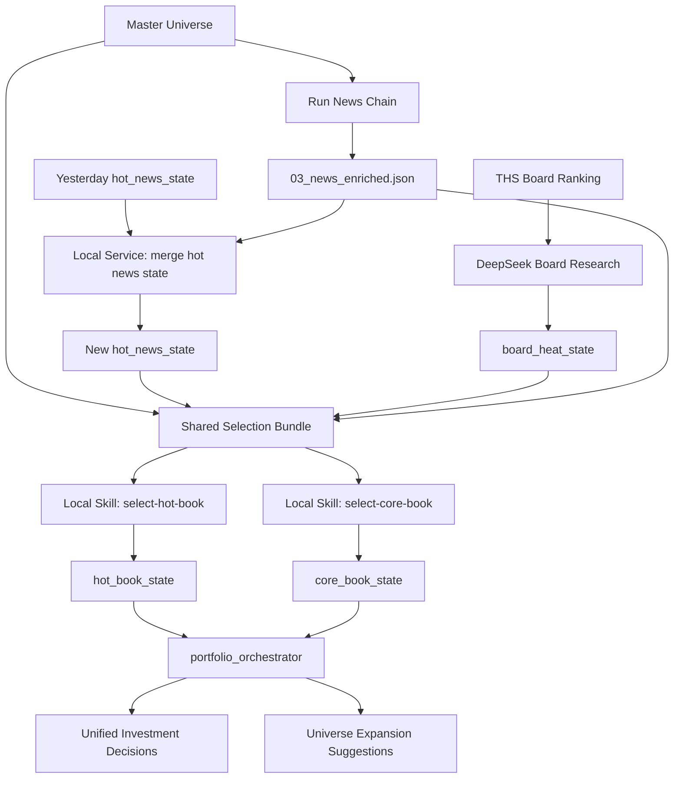

# AI选股系统一期落地设计

更新日期：2026-03-17

说明：

1. 本文件只保留当前有效的“一期设计思路与目标架构”。

## 0. 最新设计结论

当前一期的设计基线已经明确切换为以下结构：

1. 保留一个共享研究底座：`master_universe`、新闻链、`hot_news_state`、`board_heat_state`。
3. 最终决策层不再是单一 `selection_skill`，而是拆成两个不同 mandate 的策略决策头：
   - `select-hot-book`
   - `select-core-book`
4. 这两个策略簿共享输入，但持有周期、调仓逻辑、风险容忍度、输出状态不同。
5. 顶层再加一个轻量 `portfolio_orchestrator`，负责汇总两套结果、检查冲突、管理资金分配。
6. 板块层当前以 `test/test_akshare.py` 中已经验证的同花顺行业板块排行抓取逻辑为准。

换句话说，一期的主轴是：

1. 先构建高质量输入层。
2. 再做新闻渐进式状态更新。
3. 再做板块级深度研究。
4. 再分别为 `hot_book` 与 `core_book` 做策略决策。
5. 最后由组合编排层输出统一的投资建议与后续执行输入。

## 1. 背景与目标

当前主系统更适合对少量固定股票做重分析，不适合以下新场景：

1. 每天低成本维护市场热点，而不是重算全量长上下文。
2. 把盘面板块热度和新闻叙事结合起来，而不是只做单日新闻摘要。
3. 同时管理两类资金：
   - 短期追热点资金
   - 长期持有资金
4. 在既有股票宇宙不足时，让强模型主动联网扩充研究范围。
5. 为未来接入真实交易和更高频的行情数据预留结构边界。

一期目标不是直接做全自动实盘，而是先建立一条可持续扩展的选股研究链路。

一期最重要的能力是：

1. `master_universe`：主股票宇宙。
2. `hot_news_state`：由本地代码服务维护的渐进式热点状态。
3. `board_heat_state`：由板块抓取 + DeepSeek 深研得到的板块热度层。
4. `hot_book_state`：短周期热点策略簿状态。
5. `core_book_state`：中长期配置策略簿状态。
6. `portfolio_orchestrator`：统一编排两套策略簿的组合层。

`symbol_memory` 仍然有价值，但在当前阶段不再是一期主链路最优先的焦点。它可以作为后续增强层接回。

## 2. 总体架构

一期建议采用“共享研究底座 + 双策略决策头 + 组合编排层”的结构。



核心原则：

1. 共享研究底座，不共享失控的超长 prompt。
2. 新闻链负责保真清洗，不负责最终策略裁决。
3. `hot_news_state` 负责“昨天到今天”的渐进式更新，而不是每天重写世界观。
4. 板块层单独深研，因为盘面板块强弱对短期选股往往比新闻摘要更重要。
5. `hot_book` 与 `core_book` 使用同一套世界事实，但采取不同的决策视角。
6. 两套策略簿必须维护各自独立的持仓状态、换仓理由与风险约束。
7. 顶层组合编排层负责处理资金分配、冲突消解与统一输出。

## 3. 模块设计

## 3.1 `master_universe`

### 3.1.1 职责

维护整个系统长期关注的股票范围，作为所有研究与选股的上游输入。

它不是“今日候选结果”，而是“长期观察范围 + 可扩展研究底座”。

### 3.1.2 设计要求

1. 规模目标：`300-400` 只 A 股。
2. 包含：
   - 行业龙头
   - 细分赛道前排公司
   - 关键 ETF 或对冲标的
   - 少量观察型新方向标的
3. 保持底表精简，不在这一层写入运行时热点分数。

### 3.1.3 建议字段

```json
{
  "symbol": "600036.SH",
  "name": "招商银行",
  "sector": "银行",
  "industry": "股份制银行"
}
```

### 3.1.4 当前定位

1. `master_universe` 仍然是选股系统的主输入。
2. 但它不再被视为封闭集合。
3. 最终策略 skill 在必要时可以通过联网研究发现新的潜在标的。
4. 新标的应先进入“待审核扩展池”或由人工确认后回写 `master_universe`。

## 3.2 新闻链：`01 -> 02 -> 03`

### 3.2.1 目标

新闻链只负责把当天新闻处理成高质量、可供后续模型直接使用的正文集合。

### 3.2.2 当前固定产物

```text
data/selection_runs/YYYY-MM-DD/
  01_news_candidates.json
  02_news_dedup_decisions.json
  02_news_deduped.json
  03_news_enriched.json
```

### 3.2.3 职责边界

新闻链负责：

1. 候选新闻采集。
2. DeepSeek 去重与筛噪。
3. 对保留新闻打开链接，提取正文并增强。

新闻链不负责：

1. 最终主题状态更新。
2. 板块轮动研究。
3. 直接给出最终选股结论。

### 3.2.4 当前价值

`03_news_enriched.json` 是后续多个模块的共同输入：

1. `hot_news_state` 渐进式更新。
2. `select-hot-book` 与 `select-core-book` 的新闻事实底稿。
3. 必要时作为板块深研的辅助证据来源。

## 3.3 `hot_news_state`

### 3.3.1 当前定位

`hot_news_state` 的定位是：

1. 由本地代码服务维护渐进式主题状态。
2. workflow / skill 只保留薄编排外壳。

它的本质不是“今天新闻摘要”，而是“昨天的市场叙事状态，在今天新增新闻作用下，变成了什么新状态”。

### 3.3.2 输入

每个交易日更新 `hot_news_state` 时，主输入为：

1. 昨日 `hot_news_state`。
2. 今日 `03_news_enriched.json`。
3. 可选的历史辅助材料：
   - 最近若干日 `03_news_enriched.json`
   - 旧主题证据引用
   - 当前持仓摘要

### 3.3.3 输出目标

输出的新状态应回答以下问题：

1. 昨天在交易哪些主题。
2. 今天哪些主题被强化。
3. 哪些主题进入衰减。
4. 是否出现了新的重要主题。
5. 哪些主题只是噪声，不能升级为持续热点。

### 3.3.4 推荐状态结构

当前推荐把 `hot_news_state` 维护成“主题列表 + 状态摘要”的形式，而不是复杂的规则分数字典。

```json
{
  "run_date": "2026-03-17",
  "themes": [
    {
      "theme_id": "theme_rare_earth",
      "theme_name": "稀土",
      "status": "active",
      "first_seen_at": "2026-03-10T09:30:00+08:00",
      "last_seen_at": "2026-03-17T21:00:00+08:00",
      "summary": "稀土主题近几日持续获得政策与价格逻辑强化，当前仍处于活跃状态。",
      "today_delta": "今日新增政策与价格相关信息，主题强度继续提升。",
      "strength": "strengthening",
      "persistence_view": "已持续4个交易日，短期仍可能反复活跃，但需警惕高位分歧。",
      "bull_case": [
        "政策催化仍在强化",
        "行业价格逻辑得到验证"
      ],
      "bear_case": [
        "短线交易拥挤",
        "后续若无新增验证，可能快速退潮"
      ],
      "key_evidence_news_ids": ["C001", "T014"],
      "linked_boards": ["有色金属"],
      "linked_symbols": ["600111.SH", "000831.SZ"]
    }
  ],
  "market_regime_note": "今日热点更偏资源与防御，成长方向分化加大。"
}
```

### 3.3.5 设计原则

1. 重点维护主题演化，不追求每条新闻都结构化到极致。
2. 重点描述“强化 / 延续 / 分化 / 衰减 / 证伪”。
3. 明确主题持续时间与可能持续时间，而不是只给一句摘要。
4. 保留证据链接，便于后续回溯到新闻来源。
5. 不在这一步强行产出最终股票池。

### 3.3.6 实现建议

渐进式新闻总结应采用固定输入和固定输出契约的本地 skill 结构。

核心职责建议固定为：

1. 读取最近一天主题状态。
2. 从今天 `03_news_enriched.json` 抽取主题候选。
3. 召回相关既有主题。
4. 通过 `ADD / UPDATE / MERGE / ARCHIVE / DROP` 等操作生成新状态。
5. 落盘新的 `hot_news_state` 与操作日志。

详细设计见：

- [`热点新闻渐进式总结系统设计.md`](/home/zhangbeiqing/programer/AI-Value-Investing-Agent/docs/selection_system/热点新闻渐进式总结系统设计.md)

### 3.3.7 当前结论

当前已经明确的方向是：

1. 不让模型直接重写整份 `hot_news_state`。
2. 采用“规则 + embedding + LLM裁决”的混合匹配。
3. 默认倾向归档与遗忘，而不是默认保留全部旧主题。
4. 通过内部状态库维护主题生命周期，对外继续产出 JSON 文件。

仍待后续迭代的主要是阈值、字段与测试口径，而不是总体方向。

## 3.4 板块热度层：`board_heat_state`

### 3.4.1 当前定位

板块热度层是一期里非常重要的一层，甚至在短期交易视角下比单纯新闻总结更重要。

原因是：

1. 板块是盘面真实资金偏好的直接体现。
2. 板块强弱常常比单条新闻更接近交易语言。
3. 板块层可以帮助策略 skill 判断“新闻逻辑是否真正被市场交易”。

### 3.4.2 数据源修正

这里正式修正文档中的旧说法：

1. 不再以“板块异动接口”作为当前主方案。
2. 当前以 `test/test_akshare.py` 中已经验证的同花顺行业板块抓取逻辑为准。
3. 也就是先抓行业板块涨跌幅排行，再准备可选的板块相关股票线索。

### 3.4.3 当前建议流程

每日收盘后：

1. 抓取行业板块全表。
2. 选出涨幅前三板块。
3. 选出跌幅前三板块。
4. 全量维护行业板块历史指数序列，并生成当日板块量化快照。
5. 为每个板块准备可选的股票线索，或完全交给 DeepSeek 在研究后反向推荐代表股。
6. 将板块表现、量化快照、相关新闻线索以及可选的股票辅助信息一起送给 DeepSeek 做深度研究。
7. 生成当日 `board_heat_state`。

### 3.4.4 板块相关股票线索

当前已确认：

1. DeepSeek 研究的对象是“板块”，不是“逐只个股深挖”。
2. 股票在这一层只是辅助线索，用来帮助模型理解板块内部结构。
3. 这些股票不等于最终一定会被选中。

当前未完全确定：

1. 是否需要在送入 DeepSeek 之前预先带 `3` 只还是更多股票线索。
2. 如果预先带股票，优先选成交额更大的容量核心。
3. 还是优先选涨幅更大的前排情绪股。
4. 或者采用混合方案，例如：
   - `1` 只容量核心
   - `1` 只当日最强前排
   - `1` 只中军或补涨标的
5. 另一种可行方案是：不预选股票，只让 DeepSeek 先研究板块，再反向推荐应重点关注的股票。

在当前阶段，推荐先以 `test/test_akshare.py` 中的“板块内成交额前三股票”作为默认辅助线索实现，因为它更稳、更容易复盘；但要明确，这些股票只是板块研究输入的辅助信息，不是 DeepSeek 的主分析对象。

### 3.4.5 板块深度研究目标

每个板块送给 DeepSeek 后，希望模型回答：

1. 当天涨跌的直接原因是什么。
2. 背后对应的政策、产业、价格或市场风格驱动是什么。
3. 这个逻辑已经持续了多久。
4. 未来大概率还会持续多久。
5. 板块内部是集中于龙头，还是在扩散，还是已经开始分化。
6. 如果需要，当前板块最值得跟踪的几只股票是谁，以及它们各自扮演什么角色。

### 3.4.5A 板块量化快照

为了让板块层不仅能回答“今天为什么涨跌”，还可以回答“这波已经持续多久、强度是否在加速或衰减”，板块层需要先生成一份全量行业板块量化快照。

当前建议至少包含：

1. 区间收益率：`3/5/10/20/60/120/180` 交易日。
2. 区间排名：上述窗口在全体行业板块中的横截面排名。
3. 波动率：`20/60` 日年化波动率。
4. 最大回撤：`20/60/120` 日。
5. 夏普：`20/60/120` 日。
6. 连续性指标：
   - 最近 `5/10/20` 天上涨天数
   - 最近连续上涨/下跌天数
   - 最近 `10/20` 天进入涨幅前十次数
7. 宽度指标：
   - 当天上涨家数占比
   - 板块内成交额前三股票占比
   - 龙头涨幅和板块平均涨幅的偏离
8. 阶段指标：
   - 距 `20/60` 日高点回撤
   - 是否刚突破近 `20/60` 日新高
   - `5` 日收益率减 `20` 日收益率

这一层应优先由本地程序确定性计算，而不是让模型纯靠搜索或文本推断。

### 3.4.6 推荐输出结构

```json
{
  "run_date": "2026-03-17",
  "boards": [
    {
      "board_name": "稀土永磁",
      "direction": "up",
      "rank": 1,
      "change_pct": 4.82,
      "related_stock_hints": [
        {"symbol": "600111.SH", "name": "北方稀土", "role_hint": "容量核心"},
        {"symbol": "000831.SZ", "name": "中国稀土", "role_hint": "弹性前排"},
        {"symbol": "600392.SH", "name": "盛和资源", "role_hint": "中军补充"}
      ],
      "research_summary": "板块上涨主要受政策与价格预期共振驱动。",
      "driver_analysis": "今日上涨的直接催化是...",
      "persistence_analysis": "本轮逻辑已持续4个交易日，短期仍可能延续1-3日，但高位分歧风险上升。",
      "structure_view": "资金更集中在容量核心与高辨识度龙头，跟风扩散仍有限。",
      "recommended_watch_stocks": [
        {"symbol": "600111.SH", "name": "北方稀土", "reason": "容量核心，最能代表板块强度"},
        {"symbol": "000831.SZ", "name": "中国稀土", "reason": "弹性更强，适合观察情绪延续"}
      ],
      "risk_points": [
        "如果后续无新增政策验证，持续性可能下降",
        "前排个股短线涨幅较大"
      ]
    }
  ]
}
```

## 3.5 共享输入包：`selection_bundle`

### 3.5.1 当前定位

`selection_bundle` 是共享研究底座汇总后的统一输入包，供两个策略决策头复用。

### 3.5.2 主要内容

建议至少包含：

1. `master_universe`
2. 最新 `hot_news_state`
3. 最新 `board_heat_state`
4. 今日 `03_news_enriched.json`
5. 可选的当前持仓、交易摘要、基础快照
6. 组合层配置：资金总额、策略资金配比、单票上限等

### 3.5.3 设计目的

1. 避免 `hot_book` 与 `core_book` 读取不同世界事实。
2. 降低 prompt 维护成本。
3. 让后续接入真实交易、风控和分时数据时有明确总入口。

## 3.6 `hot_book_state`

### 3.6.1 职责

`hot_book_state` 描述短周期热点策略簿的当前持仓、候选观察、换仓逻辑与风险约束。

它不是一个简单的股票列表，而是“短线策略当前怎么看、持有什么、为什么持有、什么时候退出”的状态容器。

### 3.6.2 策略定位

1. 资金规模相对较小，例如 `15w`。
2. 持有周期以几天到几周为主，少数情况可到一个月。
3. 更关注热点持续性、板块强度、情绪与催化。
4. 未来接入分时线后，它会是最先使用高频数据的一层。

### 3.6.3 决策逻辑重点

`select-hot-book` 更关心：

1. 板块是否正在被市场真实交易。
2. 催化是刚出现、继续强化，还是已经衰减。
3. 龙头是否清晰。
4. 板块内部是扩散、抱团，还是已经分化。
5. 未来几天到几周还有没有交易价值。

### 3.6.4 推荐状态结构

```json
{
  "run_date": "2026-03-17",
  "capital_limit": 150000,
  "style": "hot",
  "book_summary": "当前热点集中在资源与高辨识度板块，追高风险上升，宜聚焦少量前排。",
  "positions": [
    {
      "symbol": "600111.SH",
      "name": "北方稀土",
      "role": "leader",
      "entry_thesis": "稀土板块为当前核心热点，容量核心辨识度高。",
      "holding_horizon": "days_to_weeks",
      "expected_driver_window": "1-2周",
      "exit_triggers": [
        "板块热度明显衰减",
        "龙头地位丧失",
        "高位放量分歧后无法修复"
      ],
      "risk_notes": [
        "短线涨幅已大，追高风险高"
      ]
    }
  ],
  "watchlist": [
    {
      "symbol": "000831.SZ",
      "name": "中国稀土",
      "watch_reason": "弹性更强，适合观察板块情绪延续"
    }
  ],
  "dropped_candidates": [
    {
      "symbol": "600000.SH",
      "name": "示例股票",
      "drop_reason": "原热点已明显退潮"
    }
  ],
  "risk_budget_note": "总仓位不宜过满，单一热点集中度需受限。"
}
```

### 3.6.5 退出逻辑

`hot_book` 的核心不是“买多久”，而是“何时失效”。

建议优先围绕以下条件退出：

1. 催化衰减。
2. 板块掉队。
3. 龙头地位丧失。
4. 资金结构恶化。
5. 更强的新热点出现。

## 3.7 `core_book_state`

### 3.7.1 职责

`core_book_state` 描述中长期配置策略簿的当前持仓、替换逻辑、长期 thesis 与观察对象。

它也不是一个简单的长期股票列表，而是“当前最值得长期持有的组合结构与替换判断”。

### 3.7.2 策略定位

1. 资金规模相对更大。
2. 持有周期以几个月到一年为主，必要时更长。
3. 更关注行业中长期景气、公司质量、长期预期差与估值。
4. 不会因为短期波动频繁调仓，但也不是永远不动。

### 3.7.3 决策逻辑重点

`select-core-book` 更关心：

1. 长期 thesis 是否被强化。
2. 是否出现了更好的替代标的。
3. 当前持仓里谁的中长期预期收益最差。
4. 替换某只股票后，组合整体赔率是否明显更优。
5. 是否值得付出换仓成本。

### 3.7.4 推荐状态结构

```json
{
  "run_date": "2026-03-17",
  "capital_limit": 850000,
  "style": "core",
  "book_summary": "长期池继续以行业景气和高质量资产为主，保留低换手风格。",
  "positions": [
    {
      "symbol": "600036.SH",
      "name": "招商银行",
      "long_term_thesis": "零售银行龙头，资产质量稳健，高ROE。",
      "holding_horizon": "months_to_years",
      "expected_driver_window": "6-12个月",
      "keep_reason": "当前 thesis 未被证伪，估值与确定性仍具吸引力。",
      "replace_triggers": [
        "行业逻辑转弱",
        "基本面显著恶化",
        "出现明显更优替代标的"
      ]
    }
  ],
  "watchlist": [
    {
      "symbol": "300999.SZ",
      "name": "示例股票",
      "watch_reason": "长期景气与公司竞争力改善，可能成为替代标的"
    }
  ],
  "replacement_candidates": [
    {
      "incoming_symbol": "300999.SZ",
      "incoming_name": "示例股票",
      "outgoing_symbol": "600000.SH",
      "outgoing_name": "示例旧持仓",
      "replacement_reason": "新标的长期赔率更高，旧持仓 thesis 边际变弱"
    }
  ],
  "turnover_note": "长期池以低换手为原则，只在 thesis 变化或明显更优替代出现时调整。"
}
```

### 3.7.5 替换逻辑

`core_book` 的关键不是“永远持有”，而是“低频但高质量地替换”。

建议优先围绕以下条件替换：

1. 旧持仓 thesis 被削弱或证伪。
2. 新标的中长期赔率明显更高。
3. 替换后组合整体更优。
4. 换仓收益足以覆盖交易成本和新的研究成本。

## 3.8 组合编排层：`portfolio_orchestrator`

### 3.8.1 职责

顶层编排层负责把 `hot_book_state` 与 `core_book_state` 汇总成统一组合决策。

### 3.8.2 主要任务

1. 维护策略资金配比。
2. 检查两套策略簿是否出现冲突。
3. 处理股票重叠问题。
4. 输出当日统一建议与后续执行输入。
5. 为未来接入真实交易接口做准备。

### 3.8.3 当前建议

一期建议默认采用较保守规则：

1. `hot_book` 与 `core_book` 默认不重仓同一只股票。
2. 若两边都高度看好同一股票，优先进入 `core_book`，或标记为人工审核。
3. 明确记录资金占用、策略归属和调仓来源，避免未来接实盘后混账。

## 3.9 `symbol_memory`

### 3.9.1 当前定位

`symbol_memory` 仍然是有价值的，但在最新方案中，它属于策略决策之后的增强层，而不是当前一期最核心的前置条件。

### 3.9.2 当前建议

1. 先把共享研究底座、双策略决策头和组合编排层跑顺。
2. 再把最终入选股票或重点观察股票写入 `symbol_memory`。
3. 不急着在当前阶段为全部股票建立完整记忆包。

## 4. 一期主流程

建议将一期主流程定义为：

```text
Step 1. run-news
    -> 生成 01/02/03 新闻链产物

Step 2. update-gradual-hot-news-summary
    -> 输入: 最近一天 hot_news_state + 今天 03_news_enriched.json
    -> 输出: 今天新的 hot_news_state

Step 3. build-board-heat-state
    -> 抓取涨幅前三/跌幅前三板块
    -> 准备可选的板块相关股票线索
    -> 调用 DeepSeek 做板块深度研究
    -> 输出 board_heat_state

Step 4. build-selection-bundle
    -> 汇总 master_universe + hot_news_state + board_heat_state + 03_news_enriched.json

Step 5. run-select-hot-book
    -> 输出 hot_book_state

Step 6. run-select-core-book
    -> 输出 core_book_state

Step 7. run-portfolio-orchestrator
    -> 汇总 hot_book_state + core_book_state
    -> 输出统一投资建议与扩展候选

Step 8. optional symbol-memory update
    -> 为最终入选或重点观察股票更新记忆
```

## 5. 推荐目录与产物

### 5.1 每日运行目录

```text
data/selection_runs/YYYY-MM-DD/
  01_news_candidates.json
  02_news_dedup_decisions.json
  02_news_deduped.json
  03_news_enriched.json
  04_board_candidates.json
  05_board_heat_state.json
  06_hot_news_state.json
  07_selection_bundle.md
  08_hot_book_state.json
  09_core_book_state.json
  10_portfolio_orchestrator.json
  10_portfolio_orchestrator.md
  11_universe_expansion_candidates.json
  run_manifest.json
```

说明：

1. `04_board_candidates.json` 保存板块排行与辅助股票线索原始材料。
2. `05_board_heat_state.json` 保存 DeepSeek 输出的板块研究结果。
3. `06_hot_news_state.json` 保存当天新的热点状态。
4. `07_selection_bundle.md` 是给本地强模型看的共享输入层。
5. `08` 和 `09` 分别是两套策略簿的状态输出。
6. `10` 是组合编排层产物。
7. `11` 记录策略认为值得纳入股票宇宙的新标的。

### 5.2 长期状态目录

```text
data/
  universe/
    master_universe.json
  market_state/
    hot_news_state/
      latest.json
      YYYY-MM-DD.json
    board_heat_state/
      latest.json
      YYYY-MM-DD.json
  global_cache/
    board_history_ths/
      universe.csv
      histories/<board_code>.csv
    board_metrics_ths/
      latest.json
      daily_snapshots/YYYY-MM-DD.json
      market_snapshots/YYYY-MM-DD.json
    raw_news/
      YYYY-MM-DD.json
  portfolio_state/
    hot_book/
      latest.json
      YYYY-MM-DD.json
    core_book/
      latest.json
      YYYY-MM-DD.json
  symbol_memory/
    <symbol>/
      profile.md
      thesis_state.json
      event_timeline.jsonl
      decision_history.jsonl
```

## 6. 与现有系统的关系

### 6.1 继续复用的能力

一期继续复用：

1. `shared_data_access` 的统一数据访问思想。
2. `services/` 与 `core/` 的脚本分层与日志模式。
3. 现有新闻抓取与正文增强能力。
4. 本地 skill-only 工作方式。

### 6.2 当前运行方式

1. 选股系统链路在 `selection_runs` 下独立维护。
2. 新闻、渐进式主题总结、板块热度、股票输入包应按独立步骤稳定生成。

## 7. 一期实施顺序

建议按以下顺序推进：

### 阶段 A：新闻链稳定化

1. 持续稳定 `01 -> 02 -> 03` 新闻链。
2. 保证 `03_news_enriched.json` 质量足够高。

### 阶段 B：`hot_news_state` 渐进式服务落地

1. 明确输入格式。
2. 固化状态结构、操作类型与落盘格式。
3. 实现“候选抽取 -> 主题召回 -> 操作计划 -> 应用落盘”的代码链路。

### 阶段 C：板块热度层落地

1. 按 `test/test_akshare.py` 跑通板块排行抓取。
2. 明确板块辅助股票线索方案，或明确改为由 DeepSeek 反向推荐关注股。
3. 接 DeepSeek 做板块深度研究。

### 阶段 D：双策略决策头落地

1. 设计共享 `selection_bundle`。
2. 实现 `select-hot-book` 与 `select-core-book`。
3. 固化 `hot_book_state` 与 `core_book_state` 的状态结构。

### 阶段 E：组合编排层落地

1. 汇总两套策略簿结果。
2. 设计资金配比与冲突处理规则。
3. 输出统一投资建议和股票宇宙扩展建议。

### 阶段 F：记忆层增强

1. 为最终入选股票生成或更新 `symbol_memory`。
2. 逐步把历史决策结论沉淀为长期可复用记忆。

## 8. 一期验收标准

完成一期后，至少应满足：

1. 能稳定生成 `03_news_enriched.json`。
2. 能基于“昨日状态 + 今日新闻”生成新的 `hot_news_state`。
3. 能每天稳定生成涨幅前三和跌幅前三板块的研究结果。
4. 能生成共享 `selection_bundle`。
5. 能分别输出 `hot_book_state` 与 `core_book_state`。
6. 能由组合编排层输出统一的投资建议。
7. 当股票宇宙不足时，系统能够提出新的股票扩充建议。
8. 新链路运行后不会污染现有 `skill_runs` 主链路。

## 9. 当前开放问题

当前最关键的开放问题如下：

1. `hot_news_state` 的状态字段应该精简到什么程度，才能既稳定又有交易价值。
2. 相似主题匹配和 `MERGE_THEME` 的阈值应如何验证与调优。
3. 板块辅助股票线索到底是优先选成交额大票、涨幅前排票，还是混合方案。
4. 板块深度研究输出中，哪些字段最值得长期保留进 `board_heat_state`。
5. `hot_book` 与 `core_book` 是否允许同时持有同一只股票，以及允许到什么程度。
6. 最终策略扩充股票宇宙时，是直接写入 `master_universe`，还是先进入待审核池。
7. 未来接真实交易后，分时数据应主要服务于 `hot_book`，还是部分服务 `core_book` 的择时。
8. `symbol_memory` 在一期中做到什么深度最合适。

## 10. 结论

你当前最新的一期设计，核心已经很明确：

1. 新闻链负责把当天新闻清洗成高质量输入。
2. `hot_news_state` 由本地代码服务做渐进式更新，并由模型只负责少数高语义判断。
3. 板块热度层通过同花顺行业板块排行 + DeepSeek 深研来构建。
4. 最终决策不再是单一 skill，而是共享底座上的双策略簿：
   - `hot_book`
   - `core_book`
5. 顶层再由 `portfolio_orchestrator` 统一管理资金分配、冲突处理与输出。
6. 当现有股票宇宙不足时，策略层可以联网补充研究并扩展股票宇宙。

因此，一期真正的主轴不再是“规则筛选”，而是：

1. 渐进式热点状态维护。
2. 板块热度深度研究。
3. 双策略决策头。
4. 顶层组合编排。

只要这四层跑顺，你的选股系统就已经具备了持续演化成更强本地选股 agent、并向真实交易系统过渡的基础。
