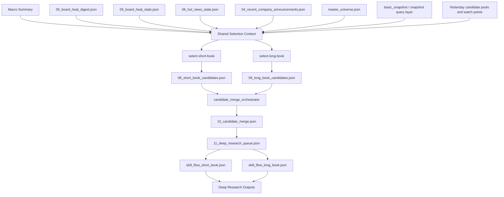

# AI选股系统一期落地设计

更新日期：2026-04-11

## 0. 当前结论

当前一期的正确主轴已经明确，不再沿用旧时代“固定股票池直接深研”的口径。

一期的正确流程是：

1. 以 `master_universe.json` 作为选股系统主输入股票宇宙。
2. 基于共享研究输入层，分别生成：
   - 短期候选池 `10` 只
   - 长期候选池 `10` 只
3. 对两池结果进行去重、合并、确定 mandate，形成最终深研股票池。
4. 深研股票池进入逐股深度分析流程：
   - 短期股票走 `skill_flow_short_book.json`
   - 长期股票走 `skill_flow_long_book.json`
5. 深研阶段必须覆盖“深研股票池中的全部股票”，而不是覆盖旧的静态配置池。
6. 最终再考虑如何把选股系统输出接入当前已有的 `auto-trading-daily-pipeline` 与交易后处理链路。

一句话：

一期不是让旧的 `TRACKED_A_STOCKS` 直接升级，而是新增一个真正独立的上游选股系统，用 `宏观 + 主题 + 板块 + 公告 + snapshot` 共同约束，从 `master_universe` 中选出值得深研的股票，再把这些股票送入下游逐股深研系统。

## 1. 背景与边界

### 1.1 旧系统是什么

当前仓库在选股系统之前，主流程本质上是：

1. 人工或配置指定 `TRACKED_A_STOCKS`
2. 生成 `skill_runs/YYYY-MM-DD/`
3. 对这批固定股票逐股深研
4. 生成 `05_decision.json`
5. 执行交易、生成总结

因此，旧链路里的很多脚本、prompt、校验逻辑，天然都以 `TRACKED_A_STOCKS` 为默认股票池。

这套机制本身没有错，但它不是选股系统，只是“固定池深研系统”。

### 1.2 新系统是什么

现在新增的一期选股系统，是一个位于深研系统上游的独立模块。

它的职责不是直接输出最终交易决策，而是：

1. 组织市场级、主题级、板块级、公告级、snapshot 级输入
2. 从 `master_universe` 中筛出值得深研的股票
3. 明确每只股票属于短期还是长期 mandate
4. 把候选股票送入下游逐股深研系统

### 1.3 当前已基本落地的上游模块

当前仓库里，已经为选股系统准备好的核心输入层包括：

1. `06_hot_news_state.json`
   - 渐进式热点主题总结
2. `05_board_heat_digest.json`
   - 板块热点导航摘要
3. `05_board_heat_state.json`
   - 板块热点研究结果
4. `basic_snapshot.py`
   - 个股 snapshot 基座
5. `master_universe.json`
   - 股票宇宙

其中：

- 新闻主题层和板块层已经是为选股系统服务的上游模块
- `basic_snapshot.py` 已经具备 snapshot 基础能力，但字段设计主要继承自旧深研系统，需要为选股系统补一层更适合初筛的查询与排序接口

### 1.4 一期不做什么

一期暂不把全部旧交易链路一起重写。

也就是说：

1. 一期先把选股系统本身设计并落地
2. 先保证它能稳定地产出短期/长期候选池和深研队列
3. 之后再把它和现有 `auto-trading-daily-pipeline`、`run_post_trade.py` 等下游链路融合

## 2. 资产范围与统一口径

### 2.1 统一资产范围

当前选股系统的统一市场范围是：

1. A股
2. 港股
3. ETF

仓库中凡是仍写成“只做 A 股”的文档、prompt 或说明，都应视为旧口径，后续需要逐步修正。

### 2.2 输入宇宙口径

选股系统的股票输入宇宙统一为：

- `data/universe/master_universe.json`

它不是装饰性文件，而是选股系统的一等输入。

### 2.3 旧静态股票池口径

`TRACKED_A_STOCKS` 的语义是旧系统中的静态深研池。

它与新选股系统的关系是：

1. 它不是选股系统的输入真源
2. 它不是一期设计的主契约
3. 它最多只可作为历史兼容层或下游执行层暂时依赖的旧接口

## 3. 一期目标

一期目标应定义为：

1. 用共享研究输入层建立今日市场事实底座
2. 基于同一事实底座，分别产出短期候选池和长期候选池
3. 把两套候选池合并成最终深研股票池
4. 为每只进入深研池的股票指定唯一 mandate
5. 把深研股票池送入对应的逐股深研 prompt flow
6. 为后续和真实交易系统融合准备稳定的上下游接口

一期的成功标准不是“已经自动交易”，而是“已经把上游选股和下游深研之间的接口设计正确并跑通”。

## 4. 设计原则

### 4.1 共享事实，不共享裁决标准

短期池和长期池看到的是同一个世界，但裁决标准不同。

- 短期池更关心：
  - 主题强化
  - 板块确认
  - 事件催化
  - 量价结构
  - 近端风险
- 长期池更关心：
  - 公司质量
  - 景气持续性
  - 盈利可靠度
  - 估值赔率
  - 是否适合跨季度持有

### 4.2 先初筛，再深研

选股系统和深研系统必须分层。

选股阶段的职责是：

1. 建立机会地图
2. 从宇宙中挑出最值得深研的股票
3. 给出进入深研的理由与待验证问题

深研阶段的职责是：

1. 对深研池中的股票逐只完成完整深度研究
2. 输出结构化分析底稿
3. 形成最终投资建议

### 4.3 snapshot 用于初筛，不直接整份塞 prompt

`basic_snapshot.py` 已经提供了 snapshot 基座，但它不应该再被当作“给模型一次性读完的超长静态文件”。

更合理的方式是：

1. 给选股系统一份字段说明
2. 提供排序、过滤、单股查询能力
3. 让 AI 在需要时读取结果，而不是整份硬塞

### 4.4 研究态输入优先于原始接口

一期要支持历史复盘/回放，因此选股系统优先依赖已经沉淀好的研究态输入：

1. `06_hot_news_state.json`
2. `05_board_heat_digest.json`
3. `05_board_heat_state.json`
4. `04_recent_company_announcements.json`
5. snapshot 查询结果

这些输入本质上是“面向复盘和 agent 消费的压缩研究状态”。

### 4.5 选股系统先独立设计，后融合交易系统

当前阶段不要让旧交易脚本的约束反向污染选股系统设计。

正确顺序是：

1. 先把选股系统的输入、产物、接口设计清楚
2. 再把它接入 `skill_runs`、`05_decision.json`、执行器、总结系统

## 5. 一期总体架构



## 6. 共享研究输入层

### 6.1 目标

共享输入层不是直接做买卖判断，而是回答：

1. 当前市场大环境是什么
2. 当前市场在交易哪些叙事
3. 这些叙事是否得到板块确认
4. 最近几天哪些个股出现了重要微观事件
5. 在股票宇宙里，哪些股票同时满足主题、板块与个股事实的交集

### 6.2 建议输入构成

#### 1. 宏观总结

建议输入最近一天宏观总结文件。

职责：

1. 定义当前 macro regime
2. 提供风险偏好、利率、通胀、美元、大宗品、地缘等上层背景
3. 作为短期与长期共同的顶层约束

#### 2. 渐进式主题总结

建议输入：

- `data/selection_runs/YYYY-MM-DD/06_hot_news_state.json`

职责：

1. 维护主题级研究记忆
2. 说明哪些主题强化、延续、退潮、证伪
3. 提供 `linked_boards`、`linked_symbols_in_universe`、风险点、观察点

#### 3. 板块热点层

建议输入：

1. `data/selection_runs/YYYY-MM-DD/05_board_heat_digest.json`
2. `data/selection_runs/YYYY-MM-DD/05_board_heat_state.json`
3. 按需调用板块查询脚本

职责：

1. 给选股系统提供“板块有没有被确认”的证据
2. 提供板块强弱、持续性、结构分化、相关股票线索
3. 在主题层和个股层之间建立中间验证层

#### 4. 微观公告输入

建议新增：

- `data/selection_runs/YYYY-MM-DD/04_recent_company_announcements.json`

职责：

1. 提供最近 `3` 天股票宇宙内公告标题摘要
2. 用于发现：
   - 业绩预告
   - 回购 / 减持
   - 监管 / 诉讼
   - 中标 / 订单
   - 并购 / 重组 / 获批
3. 为短期池提供事件催化视角
4. 为长期池提供财报与治理风险视角

建议最小字段：

1. `symbol`
2. `stock_name`
3. `published_at`
4. `summary`

#### 5. 股票宇宙

建议输入：

- `data/universe/master_universe.json`

职责：

1. 定义当前允许优先初筛的股票范围
2. 为主题层中的 `linked_symbols_in_universe` 提供映射依据
3. 作为短期池和长期池共同的筛选母集

#### 6. 股票 snapshot

当前 snapshot 基座建议统一以：

- `services/snapshot/basic_snapshot.py`

作为一期个股事实层基础。

但对选股系统而言，推荐输入形式不是直接整份 `02_basic_snapshot_payload.json`，而是：

1. snapshot 字段说明
2. snapshot 排序接口
3. snapshot 过滤接口
4. snapshot 单股查询接口

#### 7. 连续性输入

建议输入：

1. 昨日短期候选池
2. 昨日长期候选池
3. 昨日 merge 结果
4. 昨日深研后保留下来的重点观察点

职责：

1. 防止选股系统跨日失忆
2. 让长期池真正具备 thesis 延续能力
3. 区分“旧 thesis 延续”和“今日新出现机会”

## 7. Snapshot 设计

### 7.1 当前基础

当前 snapshot 基座就是 [`basic_snapshot.py`](../../services/snapshot/basic_snapshot.py)。

它已经覆盖了一批对选股系统很关键的字段，例如：

1. 估值：
   - `pe_ttm`
   - `pb`
   - `ps`
   - `pe_2y_percentile`
2. 中短期走势：
   - `daily_change_pct`
   - `return_3m`
   - `sharpe_3m`
   - `volatility_3m`
   - `max_drawdown_3m`
3. 质量与增长：
   - `revenue_growth_yoy`
   - `net_income_growth_yoy`
   - `gross_margin`
   - `net_profit_margin`
   - `roe`
4. 流动性：
   - `turnover_rate`
   - `avg_turnover_30d`
   - `liquidity_score`

### 7.2 当前不足

当前 `basic_snapshot.py` 的字段与输出方式，主要继承自旧深研系统的使用习惯。

对选股系统来说，仍缺少一层“供初筛使用的查询接口”：

1. 不能只输出大 JSON 文件
2. 需要支持 agent 按字段排序
3. 需要支持 agent 按条件筛选
4. 需要支持 agent 对个别股票做单股查询

### 7.3 一期推荐方案

建议把 snapshot 使用方式定义为：

1. 字段说明文档
2. CLI 查询脚本
3. 排序/筛选结果输出

建议脚本形态类似：

```bash
python scripts/query_stock_snapshot.py --date YYYY-MM-DD --symbol 600406.SH
python scripts/query_stock_snapshot.py --date YYYY-MM-DD --symbol 01810.HK
python scripts/rank_stock_snapshot.py --date YYYY-MM-DD --field roe --top 20
python scripts/filter_stock_snapshot.py --date YYYY-MM-DD --expr "liquidity_score >= 0.6 and pe_ttm <= 25"
```

### 7.4 短期池优先字段

短期池建议优先关注：

1. `daily_change_pct`
2. `return_3m`
3. `sharpe_3m`
4. `volatility_3m`
5. `max_drawdown_3m`
6. `turnover_rate`
7. `avg_turnover_30d`
8. `liquidity_score`

### 7.5 长期池优先字段

长期池建议优先关注：

1. `roe`
2. `revenue_growth_yoy`
3. `net_income_growth_yoy`
4. `gross_margin`
5. `net_profit_margin`
6. `pe_ttm`
7. `pb`
8. `ps`
9. `pe_2y_percentile`
10. `return_1y`
11. `max_drawdown_1y`

## 8. 双选股头设计

### 8.1 `select-short-book`

#### 定位

短期候选池，目标持有 `1-2` 个月。

#### 主要关注点

1. 主题是否强化
2. 板块是否确认
3. 公告或新闻催化是否具有近端交易价值
4. 个股是否具备足够流动性和短中期强度
5. 当前是否仍处于可参与阶段

#### 建议输出

固定输出 `10` 只候选股，每只至少包含：

1. `symbol`
2. `stock_name`
3. `selected_reason`
4. `theme_alignment`
5. `board_confirmation`
6. `announcement_signal`
7. `snapshot_highlights`
8. `holding_horizon`
9. `why_short_book`
10. `main_risks`
11. `priority_rank`

### 8.2 `select-long-book`

#### 定位

长期候选池，目标持有 `3-12` 个月。

#### 主要关注点

1. 行业长期逻辑是否仍在
2. 公司质量和盈利能力是否足够强
3. 当前估值是否仍有中期赔率
4. 财报窗口和公告风险是否可控
5. 昨日 thesis 是否被强化、延续或削弱

#### 建议输出

固定输出 `10` 只候选股，每只至少包含：

1. `symbol`
2. `stock_name`
3. `selected_reason`
4. `long_term_thesis`
5. `valuation_view`
6. `quality_view`
7. `earnings_reliability_view`
8. `announcement_risk_check`
9. `holding_horizon`
10. `why_long_book`
11. `main_risks`
12. `priority_rank`

## 9. 候选池合并层

### 9.1 为什么需要 merge

短期池和长期池共享事实底座，因此同一只股票可能同时被两边选中。

这是正常现象，不应在前面强行禁止。

需要 merge 层来回答：

1. 是否需要去重
2. 最终 mandate 归属是什么
3. 进入深研时优先看短期逻辑还是长期逻辑
4. 深研时最关键待验证问题是什么

### 9.2 merge 的职责

1. 去重
2. 处理两池重叠
3. 为每只股票确定唯一深研 mandate
4. 形成最终深研股票池

建议 mandate 枚举：

1. `short_book`
2. `long_book`

对于同时进入两池的股票，不在深研层保留双 mandate 并行写法，而是在 merge 层就确定本轮唯一归属。

### 9.3 merge 输出

建议输出两个文件：

1. `10_candidate_merge.json`
2. `11_deep_research_queue.json`

其中 `11_deep_research_queue.json` 每个条目至少包含：

1. `symbol`
2. `stock_name`
3. `selected_from`
4. `final_mandate`
5. `priority_rank`
6. `entry_reasons`
7. `questions_to_verify`

## 10. 与下游深研系统的衔接

### 10.1 当前结论

当前逐股深研能力仍然主要沉淀在旧 `skill_flow` 体系中。

但要明确：

1. 旧 `skill_flow.json` 本质上是偏长期深研口径
2. 它是在“没有选股系统”的时代写的
3. 它不应再被当作选股系统本身

### 10.2 新的下游深研入口

一期建议把下游深研拆成：

1. `skill_flow_short_book.json`
2. `skill_flow_long_book.json`

两者的输入股票池都不是旧的静态池，而是：

- 本轮 `11_deep_research_queue.json` 中分配给对应 mandate 的股票列表

### 10.3 两套深研 flow 的关系

建议复用的部分：

1. 工作流整体结构
2. 工具使用规范
3. 数据与时间约束
4. 最终结构化分析底稿格式

必须分开的部分：

1. 角色定位
2. 决策与风控要求
3. 对催化和量价的权重
4. 对财报窗口和短期风险的敏感度

### 10.4 “所有股票都覆盖”的正确含义

今后在深研系统里，“所有股票都覆盖”的正确含义是：

1. 覆盖本轮深研股票池中的全部股票
2. 不是覆盖旧时代 `TRACKED_A_STOCKS`
3. 如果本轮深研池里有 `10` 只股票，那么“所有股票”就是这 `10` 只

## 11. 建议产物结构

### 11.1 `selection_runs`

建议一期逐步收敛到：

```text
data/selection_runs/YYYY-MM-DD/
  03_news_prompt_input.json
  04_recent_company_announcements.json
  05_board_heat_digest.json
  05_board_heat_state.json
  06_hot_news_state.json
  07_shared_selection_context.md
  08_short_book_candidates.json
  09_long_book_candidates.json
  10_candidate_merge.json
  11_deep_research_queue.json
  run_manifest.json
```

说明：

1. `selection_runs` 是选股系统主产物目录
2. 它负责市场级和候选池级输入，不负责最终交易执行

### 11.2 `skill_runs`

建议继续保留：

```text
data/skill_runs/YYYY-MM-DD/
  01_global_context.md
  02_basic_snapshot_payload.json
  03_agent_input.md
  04_stock_research/
  05_decision.json
  06_execution_log.json
  07_daily_summary.json
  08_history_merge.json
```

但要重新理解其定位：

1. `skill_runs` 是下游深研与交易决策目录
2. 它未来应消费选股系统输出，而不是自己再扮演选股系统

## 12. 一期主流程

```text
Step 1. 生成共享输入层
    -> 宏观总结
    -> 03_news_prompt_input.json
    -> 05_board_heat_digest.json
    -> 05_board_heat_state.json
    -> 06_hot_news_state.json
    -> 04_recent_company_announcements.json
    -> master_universe.json

Step 2. 构建 shared_selection_context
    -> 汇总宏观、板块、主题、公告、连续性输入、snapshot 使用说明

Step 3. 运行 select-short-book
    -> 产出 10 只短期候选股

Step 4. 运行 select-long-book
    -> 产出 10 只长期候选股

Step 5. 运行 candidate_merge_orchestrator
    -> 去重
    -> 确定 mandate
    -> 形成深研股票池

Step 6. 生成 11_deep_research_queue.json
    -> 进入下游逐股深研系统

Step 7. 按 mandate 分发深研
    -> short_book 股票走 skill_flow_short_book.json
    -> long_book 股票走 skill_flow_long_book.json

Step 8. 后续再与 auto-trading-daily-pipeline 融合
```

## 13. 一期实施顺序

### 阶段 A：共享输入层固化

1. 固化宏观总结输入口径
2. 固化 `06_hot_news_state.json`
3. 固化 `05_board_heat_digest.json` 与 `05_board_heat_state.json`
4. 增加 `04_recent_company_announcements.json`

### 阶段 B：snapshot 查询层

1. 固化 `basic_snapshot.py` 在选股系统中的字段口径
2. 增加 snapshot 字段说明
3. 增加排序、筛选、单股查询接口

### 阶段 C：双选股头

1. 实现 `select-short-book`
2. 实现 `select-long-book`
3. 固化输出契约

### 阶段 D：候选池合并层

1. 实现 `candidate_merge_orchestrator`
2. 产出 `10_candidate_merge.json`
3. 产出 `11_deep_research_queue.json`

### 阶段 E：下游深研 flow

1. 设计 `skill_flow_short_book.json`
2. 重构 `skill_flow_long_book.json`
3. 明确两者如何消费深研股票池

### 阶段 F：与旧交易链路融合

1. 把选股系统输出接入现有 `skill_runs`
2. 再处理 `run_post_trade.py`、执行器、总结系统与新候选池之间的兼容

## 14. 一期验收标准

完成一期后，至少应满足：

1. 能稳定生成共享输入层
2. 能基于 `master_universe` 分别输出短期候选池和长期候选池
3. 能把最近 `3` 天公告标题纳入初筛
4. 能让两个选股头对 snapshot 做按需检索，而不是整份硬塞上下文
5. 能稳定产出 `10_candidate_merge.json` 与 `11_deep_research_queue.json`
6. 能让深研系统只覆盖深研池中的全部股票
7. 能清楚区分“短期看机会”和“长期可持有”的理由
8. 能保持选股系统与当前旧交易链路的模块边界清晰

## 15. 当前明确结论

当前已经明确、不再反复讨论的口径有：

1. `master_universe` 是选股系统输入真源
2. `TRACKED_A_STOCKS` 是旧系统静态池，不是选股系统真源
3. 资产范围统一为 `A股 + 港股 + ETF`
4. 短期池固定 `10` 只，长期池固定 `10` 只
5. 同一只股票允许在候选阶段同时进入两池，但必须在 merge 层确定唯一深研 mandate
6. 深研阶段的“所有股票都覆盖”，是指覆盖本轮深研池中的全部股票
7. 当前先把选股系统设计与实现好，最后再和 `auto-trading-daily-pipeline` 融合
8. 历史复盘/回放应主要依赖研究态输入文件，而不是简单依赖原始接口快照

## 16. 结论

当前一期设计的核心主轴已经收敛为：

1. 共享研究输入层
2. 双 mandate 候选池初筛
3. merge 合并与深研股票池
4. mandate 化的下游逐股深研
5. 后续再与交易系统融合

因此，一期最重要的不是立刻改交易脚本，而是先把以下几件事真正做对：

1. 让 `master_universe`、主题、板块、公告、snapshot 五层输入协同起来
2. 在同一事实底座上稳定地产出短期池与长期池
3. 让 snapshot 通过查询层服务初筛
4. 把深研池与下游 `skill_flow_short_book.json` / `skill_flow_long_book.json` 的接口设计清楚
5. 为后续和现有交易链路融合保留稳定边界

只要这几层闭环跑顺，一期就已经具备向完整 AI 选股系统和真实交易系统演进的基础。
