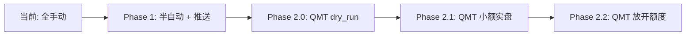
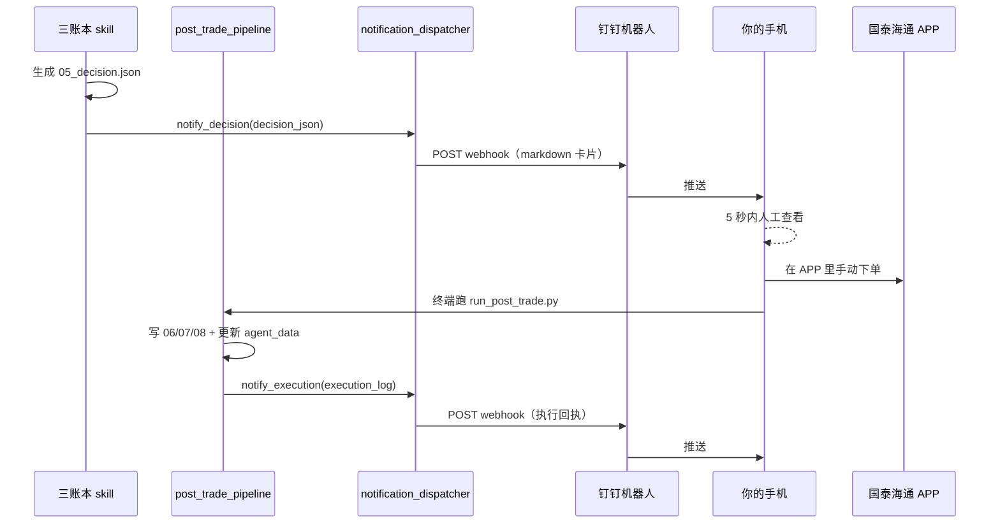
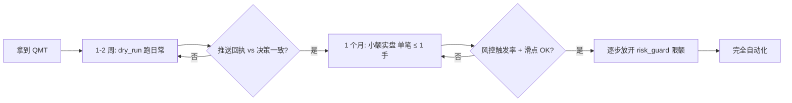

# 自动交易系统设计

更新日期：2026-06-12

## 1. 背景与目标

当前项目的交易闭环是「**模型生成 `05_decision.json` → 人工查看 → 手动跑 `run_post_trade.py`**」，整个流程都需要人在终端前操作，存在三个问题：

1. **决策无实时通知**：模型跑完不会主动告诉你「该看了」
2. **执行依赖手动**：必须人工在国泰海通 APP 里下单，再回来跑后处理脚本
3. **盘中无监控**：持仓股触发止损 / 止盈 / 异常波动时，没有人值守

本设计把自动化拆为**两个阶段递进**：

- **Phase 1（半自动 + 实时推送）**：决策与执行结果都推送到手机，人工 5 秒内在国泰海通 APP 完成下单，**无资金门槛、无监管风险、今天即可上线**
- **Phase 2（QMT 真自动）**：在拿到国泰海通 QMT 量化权限后，用 `xtquant` 直接下单，配合多层风控与灰度发布，**实现真正无人值守自动交易**

**总原则：安全永远优先于自动化收益。**

## 2. 总体路线图



| 阶段 | 资金风险 | 监管合规 | 实施周期 | 必要前提 |
| --- | --- | --- | --- | --- |
| Phase 1 | **零**（仍人工下单） | ✅ 完全合规 | 1-2 天 | 创建钉钉机器人 |
| Phase 2.0 dry_run | **零**（只打印不下单） | ✅ 完全合规 | QMT 拿到后 3-5 天 | 拿到 QMT 客户端 |
| Phase 2.1 小额实盘 | 极低（单笔 ≤ 1 手） | ✅ 完全合规 | dry_run 跑 2 周后 | dry_run 无异常 |
| Phase 2.2 放开 | 受 risk_guard 控制 | ✅ 完全合规 | 小额跑 1 个月后 | 小额无异常 + 复盘通过 |

---

## 3. Phase 1：半自动 + 实时推送

### 3.1 工作流



### 3.2 推送渠道选型

| 候选 | 优势 | 劣势 | 决策 |
| --- | --- | --- | --- |
| **钉钉自定义机器人** | 个人可直接用、配置最简单（webhook + 加签）、markdown 卡片美观、国内延迟 < 1s | 需安装钉钉 | ⭐ **默认采用** |
| 企业微信机器人 | 群聊推送方便 | 需要企业租户 | 备选（插件实现） |
| 飞书自定义机器人 | 字节系生态 | 需要企业租户 | 备选（插件实现） |
| Bark | iOS 原生，延迟低 | 仅 iOS | 备选（插件实现） |
| Server酱 / PushPlus | 直接推到微信 | 5-10s 延迟、配额限制 | 备选（插件实现） |
| 邮件 SMTP | 通用、可靠 | 延迟高、不适合盘中告警 | 备选（插件实现） |

**默认理由**：钉钉自定义机器人是国内**唯一**对个人零门槛、零延迟、零成本，且支持 markdown 卡片的方案。可以专门建一个「我的股票交易」单人群，把机器人加进去。

### 3.3 模块设计

#### 3.3.1 新增 `services/trading/notification_dispatcher.py`

抽象的推送分发层，三层结构：

```python
# 第 1 层：抽象接口
class NotificationChannel:
    def send(self, title: str, content_md: str, urgency: str) -> bool: ...

# 第 2 层：具体 channel 实现
class DingTalkChannel(NotificationChannel): ...
class WeComChannel(NotificationChannel): ...
class FeishuChannel(NotificationChannel): ...
class BarkChannel(NotificationChannel): ...
class EmailChannel(NotificationChannel): ...

# 第 3 层：业务高层接口（被 post_trade_pipeline 调用）
def notify_decision(book_type: str, decision: dict, run_date: str) -> None: ...
def notify_execution(book_type: str, execution_log: dict, run_date: str) -> None: ...
def notify_alert(level: str, title: str, body: str) -> None: ...
```

设计要点：

- **多 channel 并行**：`notify_*` 内部按 `configs/notification.yaml` 取所有启用 channel，并行发送，任一成功即视为成功
- **失败不阻塞主流程**：推送失败只 `logger.warning`，绝不抛异常打断 `run_post_trade`
- **重试**：单 channel 内部最多重试 2 次，间隔 1s / 3s
- **统一日志**：使用 `core.logging.get_logger("NotificationDispatcher")`

#### 3.3.2 新增 `configs/notification.yaml`

```yaml
default_channels: [dingtalk]
channels:
  dingtalk:
    enabled: true
    webhook_url_env: DINGTALK_WEBHOOK_URL
    secret_env: DINGTALK_SECRET
    at_mobiles: []
  wecom:
    enabled: false
    webhook_url_env: WECOM_WEBHOOK_URL
  feishu:
    enabled: false
    webhook_url_env: FEISHU_WEBHOOK_URL
    secret_env: FEISHU_SECRET
  bark:
    enabled: false
    device_key_env: BARK_DEVICE_KEY
    server_url: https://api.day.app
  email:
    enabled: false
    smtp_host: smtp.qq.com
    smtp_port: 465
    sender_env: SMTP_SENDER
    password_env: SMTP_PASSWORD
    receivers: []

# 按消息类型 + 紧急程度路由
routing:
  decision:
    fixed_tracked: [dingtalk]
    short_book: [dingtalk]
    long_book: [dingtalk]
  execution:
    "*": [dingtalk]
  alert:
    critical: [dingtalk, email]    # 高危事件双通道
    warning: [dingtalk]
    info: [dingtalk]
```

#### 3.3.3 `.env` 扩展

```ini
# 钉钉自定义机器人 webhook（创建机器人时拿到）
DINGTALK_WEBHOOK_URL=https://oapi.dingtalk.com/robot/send?access_token=xxx
DINGTALK_SECRET=SECxxx    # 启用加签时填，强烈建议启用
```

**安全约定**：

- 所有 webhook URL / token 只能存 `.env`，**绝对不能进 git**
- `configs/notification.yaml` 只存 `*_env` 字段名，**不存实际 secret**
- 启用加签（钉钉 / 飞书都支持）后，即使 URL 泄漏，攻击者也无法直接调用

#### 3.3.4 集成点（最小改动）

`services/trading/post_trade_pipeline.py` 里**两处**新增调用：

```python
# A. 入口（execute_trade_from_decision 开头，验证 decision 之后）
from services.trading.notification_dispatcher import notify_decision
notify_decision(book_type=book_type, decision=decision, run_date=run_date)

# B. 出口（run_post_trade 结尾，所有产物落盘后）
from services.trading.notification_dispatcher import notify_execution
notify_execution(book_type=book_type, execution_log=load_json(log_path), run_date=run_date)
```

另外：

- `services/data_refresh/refresh_orchestrator.py` 在 `overall_status="failed"` 时调用 `notify_alert("critical", ...)`
- `scripts/refresh_all_for_date.py` 失败时同样

### 3.4 推送消息格式

#### 3.4.1 决策推送（`notify_decision`）

```text
🎯 [short_book] 2026-06-12 决策已生成
━━━━━━━━━━━━━━━━━━━━━━

📊 共 5 只股票，3 BUY / 1 SELL / 1 HOLD

🟢 BUY
  600276 恒瑞医药  100股 @48.60 置信度0.75
  300750 宁德时代  200股 @196.00 置信度0.68
  ...

🔴 SELL
  600519 贵州茅台  100股 @1450.00 置信度0.82

🟡 HOLD
  600036 招商银行（维持）

⚠️ 系统风险提示
  - 美伊战争走向不明，下午波动可能加剧
  - 6/12 PPI 数据 22:30 公布

📁 详细分析：data/skill_runs/2026-06-12/short_book/05_decision.json
👉 确认下单后跑：
   python scripts/run_post_trade.py --date 2026-06-12 --book-type short_book --signature book-short_book
```

#### 3.4.2 执行回执（`notify_execution`）

```text
✅ [short_book] 2026-06-12 后处理完成
━━━━━━━━━━━━━━━━━━━━━━

🟢 实际成交
  600276 恒瑞医药  BUY 100股 @48.62 ✓
  300750 宁德时代  BUY 200股 @196.10 ✓

🔴 实际成交
  600519 贵州茅台  SELL 100股 @1448.50 ✓

❌ 失败 / 跳过
  （无）

📈 当日总览
  组合总市值: 568,234.56 元 (+2,156.40 / +0.38%)
  现金余额:   31,765.44 元
  当日盈亏:   +2,156.40 元 (+0.38%)
```

#### 3.4.3 告警（`notify_alert`）

```text
🚨 [CRITICAL] refresh_all_for_date 失败
━━━━━━━━━━━━━━━━━━━━━━

阶段: selection.build-factor-store
错误: TimeoutError: akshare connection timeout after 30s
时间: 2026-06-12 07:15:23

请立即检查并重跑：
   python scripts/refresh_all_for_date.py --date 2026-06-12
```

### 3.5 安全约定

1. **推送内容白名单字段**：决策推送**只**包含 symbol / stock_name / action / price / shares / confidence / key_risk，**不**包含 account_id / 账户余额绝对值 / API token 等敏感信息
2. **不推送账户密码 / 持仓总额绝对值的明文**（如必须，用 base64 编码 + 仅末四位）
3. **加签校验**：钉钉 / 飞书启用 webhook 加签，配置在 `.env`
4. **推送失败 ≠ 主流程失败**：notification_dispatcher 内部 try/except 兜底，绝不抛异常上传
5. **本地保留全量日志**：所有推送内容同时落 `logs/services/trading/notification/`，便于事后审计
6. **限流**：单 channel 默认 10 条/分钟，避免推送风暴打爆机器人配额

### 3.6 测试与灰度

- **单元测试**：mock webhook URL，验证消息格式正确
- **联调测试**：在自己钉钉群里推一条「测试消息」
- **试运行**：本周末用真实 `05_decision.json` 模拟跑一次 `run_post_trade`，看推送是否到位
- **真实使用**：下周一开始接入日常主流程

---

## 4. Phase 2：QMT 真自动（规划）

### 4.1 用户侧 QMT 开通 checklist

> 这部分完全由你与国泰海通客户经理对接，代码侧不参与。

| 步骤 | 内容 | 注意 |
| --- | --- | --- |
| 1 | 联系国泰海通**专属客户经理**（不要走 APP 自助申请） | 默认开户没有 QMT 权限 |
| 2 | 提供资产证明：近 20 个交易日日均资产 ≥ 50 万 | 现金 + 股票 + 基金都算 |
| 3 | 提供交易经验：≥ 6 个月 A 股交易记录 | 一般有账户就满足 |
| 4 | 在 APP 重做风险测评，结果 ≥ C4 积极型 | 不到的话重答几次 |
| 5 | 签署《量化交易风险揭示书》 | 必须阅读 |
| 6 | 确认免费开通，**拒绝任何收费项目** | 头部券商 QMT 都免费 |
| 7 | 确认附赠权益：Level-2 行情、专人指导、高优先级服务器 | 头部券商默认包含 |
| 8 | 下载 QMT 客户端（迅投官方） | 区分完整版 / miniQMT |
| 9 | 安装 `xtquant` Python SDK | `pip install xtquant`，但**实际部署在 QMT 安装目录下** |
| 10 | 拿到模拟盘账号 | 真实账号会先开模拟，至少跑 1-3 个月 |

### 4.2 代码侧改造预览

#### 4.2.1 新增 `services/trading/brokers/`

```text
services/trading/brokers/
├── __init__.py
├── base.py              # BrokerExecutor 抽象接口
├── manual_executor.py   # 当前流程的等价封装（仅写本地 jsonl）
├── dry_run_executor.py  # 沙盒模式：所有调用只打印 + 推送，不真下单
└── qmt_executor.py      # xtquant 真实下单
```

抽象接口：

```python
class BrokerExecutor(Protocol):
    def buy(self, symbol: str, shares: int, price: float, order_type: str = "limit") -> OrderResult: ...
    def sell(self, symbol: str, shares: int, price: float, order_type: str = "limit") -> OrderResult: ...
    def query_position(self) -> List[Position]: ...
    def query_order(self, order_id: str) -> OrderStatus: ...
    def cancel(self, order_id: str) -> bool: ...
    def query_balance(self) -> Balance: ...
```

`OrderResult` / `Position` / `OrderStatus` / `Balance` 是统一的数据类，三种 executor 都返回同样的结构。

#### 4.2.2 新增 `services/trading/risk_guard.py`

**所有 BUY / SELL 必须先过 risk_guard，任一规则失败 = 拦截 + critical 告警**：

| 规则 | 默认阈值 | 可配置 |
| --- | --- | --- |
| 单笔金额上限 | ≤ 总资产 5% | `risk_guard.yaml: max_order_pct` |
| 单股权重上限 | ≤ 总资产 20% | `risk_guard.yaml: max_position_pct` |
| 日内累计亏损熔断 | ≤ -3% | `risk_guard.yaml: max_daily_loss_pct` |
| 价格偏离保护 | 下单价 vs 最新价偏离 ≤ ±2% | `risk_guard.yaml: max_price_deviation_pct` |
| 涨跌停价检查 | 不允许追涨停 / 杀跌停 | `risk_guard.yaml: forbid_limit_order` |
| 单股日内最多操作次数 | ≤ 3 次 | `risk_guard.yaml: max_daily_ops_per_symbol` |
| 黑名单 | 任何在黑名单的 symbol 拒绝下单 | `risk_guard.yaml: blacklist` |
| 交易时段 | 仅 09:30-11:30 / 13:00-14:55 允许下单 | `risk_guard.yaml: trading_hours` |

风控配置文件 `configs/risk_guard.yaml`：

```yaml
fixed_tracked:
  max_order_pct: 0.05
  max_position_pct: 0.20
  max_daily_loss_pct: -0.03
  max_price_deviation_pct: 0.02
  max_daily_ops_per_symbol: 2
short_book:
  max_order_pct: 0.03         # 短线池更激进时更严格
  max_position_pct: 0.15
  max_daily_loss_pct: -0.02
  max_price_deviation_pct: 0.02
  max_daily_ops_per_symbol: 3
long_book:
  max_order_pct: 0.10         # 长期池可以更大单笔
  max_position_pct: 0.30
  max_daily_loss_pct: -0.05
  max_price_deviation_pct: 0.03
  max_daily_ops_per_symbol: 1

global:
  forbid_limit_order: true     # 不允许涨停价买入 / 跌停价卖出
  blacklist: []                # symbol 黑名单
  trading_hours:               # 中国 A 股交易时段
    morning: ["09:30", "11:30"]
    afternoon: ["13:00", "14:55"]   # 14:55 后不下单，避免尾盘冲单
```

#### 4.2.3 `scripts/run_post_trade.py` 扩展

```bash
# 当前（保持向后兼容）
python scripts/run_post_trade.py --date 2026-06-12 --book-type short_book --signature book-short_book
# 等价于 --executor manual

# Phase 2 新增
python scripts/run_post_trade.py --date 2026-06-12 --book-type short_book --executor dry_run
python scripts/run_post_trade.py --date 2026-06-12 --book-type short_book --executor qmt
```

`--executor` 取值：

- `manual`（默认）：当前行为，假设你已在 APP 手动下单，只写本地账本
- `dry_run`：调 BrokerExecutor 接口但**所有 buy/sell 只打印并推送**，**不真下单**
- `qmt`：真实通过 `xtquant` 下单

### 4.3 灰度发布流程



**关键里程碑**：

- **dry_run 阶段** ≥ 2 周，至少跑过 10 个交易日，每天对比 dry_run 推送的「假装下单」内容 vs 你实际在 APP 里的下单内容，确认一致
- **小额实盘** ≥ 1 个月，单笔上限 1 手（最小交易单位 100 股），即便单只股票全亏，损失也可控
- **任何阶段触发熔断或异常，立即降级回上一阶段**

### 4.4 推荐的 QMT 安全运行环境

- **专用机器**：QMT 跑在专门的 Windows 机器或云主机上，**不与日常浏览/办公混用**
- **网络隔离**：QMT 所在机器只允许访问国泰海通服务器 + 内部信号通道（数据库 / Redis）
- **账户权限分离**：QMT 客户端使用**子账户**（如果国泰海通支持），主账户保留人工备用
- **每日强制对账**：每日收盘后，将 QMT 报单记录 vs `position.jsonl` 自动对账，差异 > 0 → critical 告警

---

## 5. 风险评估与免责

### 5.1 资金风险

| 风险类型 | 风险等级 | 缓解措施 |
| --- | --- | --- |
| 代码 bug 导致错单 | 🔴 高 | risk_guard 多层校验 + dry_run 灰度 + 推送实时人工监督 |
| 网络延迟导致滑点 | 🟡 中 | 价格偏离保护、限价单而非市价单 |
| 模型决策错误 | 🟡 中 | 单笔金额上限 + 日内亏损熔断 |
| 国泰海通 QMT 服务故障 | 🟡 中 | 故障时降级到 manual + critical 告警 |
| akshare 实时数据延迟 | 🟢 低 | Phase 1 不依赖、Phase 2 用 QMT 内置行情 |
| 推送渠道故障 | 🟢 低 | 多 channel 并行、本地日志兜底 |

### 5.2 合规风险

- Phase 1 不涉及任何自动下单，与「人工在 APP 手动下单」完全等价，**零合规风险**
- Phase 2 使用国泰海通官方 QMT 接口，签了 `《量化交易风险揭示书》`，**完全合规**
- **永远不要使用 easytrader 等模拟同花顺客户端的方案**——灰色合规、安全性低

### 5.3 操作风险

- 推送 webhook secret 泄漏 → 启用加签后影响很小
- 钉钉机器人被禁用 → 自动降级到备选 channel（如果配置了）
- QMT 客户端崩溃 → 心跳监控 + critical 告警 + 自动降级到 manual

### 5.4 免责声明

本系统是辅助工具，**所有交易决策与结果的最终责任由账户持有人承担**。系统作者与维护者不对：

- 模型决策导致的盈亏
- 代码 bug 导致的错单
- 第三方数据源 / 券商接口故障导致的损失

负任何法律或经济责任。在使用前请充分理解：

- A 股市场风险
- 程序化交易风险
- 模型策略局限性
- 监管政策变动可能性

---

## 6. 待办与里程碑

### Phase 1（立即可做）

- [ ] 创建钉钉机器人 → 拿到 webhook URL + secret，写入本地 `.env`
- [ ] 实现 `services/trading/notification_dispatcher.py`
- [ ] 实现 `configs/notification.yaml`
- [ ] 集成到 `services/trading/post_trade_pipeline.py`
- [ ] 集成到 `services/data_refresh/refresh_orchestrator.py` 失败告警
- [ ] 集成到 `scripts/refresh_all_for_date.py` 失败告警
- [ ] 跑一次真实 smoke test，确认推送到位
- [ ] 文档：在 `AGENTS.md` 与 `docs/PROJECT_SYSTEM_SUMMARY.md` 加自动通知章节

### Phase 2（QMT 拿到后）

- [ ] 设计 `services/trading/brokers/base.py` 抽象接口
- [ ] 实现 `manual_executor.py`（包装当前流程）
- [ ] 实现 `dry_run_executor.py`（沙盒）
- [ ] 实现 `qmt_executor.py`（xtquant 真实下单）
- [ ] 实现 `services/trading/risk_guard.py`
- [ ] 实现 `configs/risk_guard.yaml`
- [ ] 改造 `scripts/run_post_trade.py` 支持 `--executor`
- [ ] 文档：`docs/trading_automation/qmt_integration.md`
- [ ] 灰度：dry_run 2 周 → 小额 1 月 → 放开

### 长期演进

- [ ] 盘中实时监控（基于 `stock_bid_ask_em` 的持仓告警）
- [ ] 多账户/多券商支持（broker 抽象层天然支持）
- [ ] 策略回测与实盘对比的自动报告
- [ ] 风控规则的自动学习与调整（基于历史数据回测）

---

## 7. 相关文档

- `docs/PROJECT_SYSTEM_SUMMARY.md` — 整体架构与日常主流程
- `docs/trade_summary/README.md` — 交易后处理与历史决策合并
- `.codex/rules/skill-pipeline.md` — 01-08 产物契约与交易后处理约束
- `services/trading/post_trade_pipeline.py` — 当前后处理实现
- `services/trading/trade_executor.py` — 当前下单接口（Phase 2 将被 BrokerExecutor 抽象封装）
